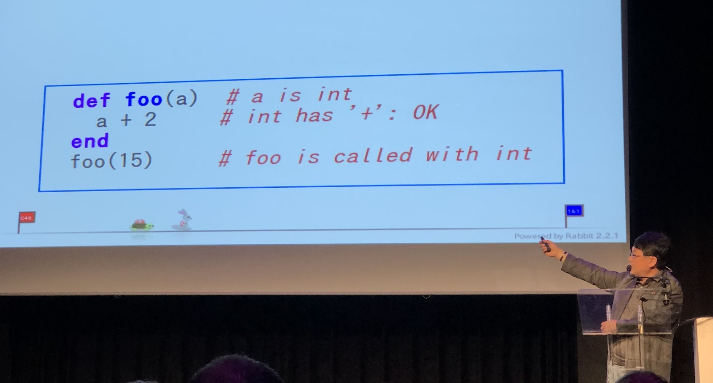
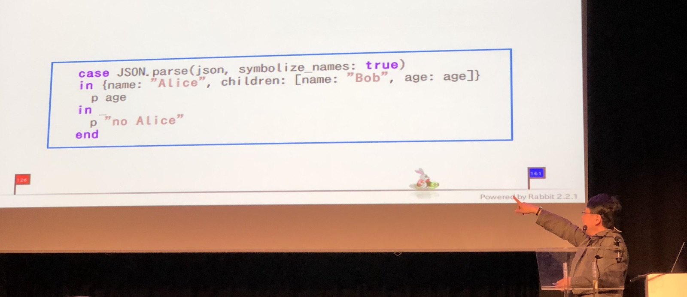

[👈 Back to all talks 👈](../README.md)

---

# Keynote: Functional (Future) Ruby

## Yukihiro Matsumoto [@yukihiro_matz](https://twitter.com/yukihiro_matz) 

Ruby 3.0 is scheduled for December 2020. THere are still some things that need to be improved before it’s ready.

1. Static Typing

   It helps writing software that works. Dynamic Typing requires us to write a lot of reduntant tests, but it’s not the most pleasant part of programming. Many other scripting languages already have Static Typing extensions. One option is type annotation, which may not be the bes solution, because it is not DRY. 

   There is an idea to add type description files that will allow creating type definitions for our code. There is a tool avialable for this: https://github.com/ruby/ruby-signature

   

   Another problem is type definition for libraries. Both standard ruby library and community gems. The idea is to collect and detect type information beforehand and use this information for generating type definitions files. It would be possible to refine generated files.

   Then, there are "Level 2" Type Checking solutions. First of them is [Sorbet](https://github.com/sorbet/sorbet) from Stipe, and the second one si called [Steep](https://github.com/soutaro/steep).

   Without doing anything our Ruby code will be type checked. There will be an option to additionally annotate our code to get even better checking. Results are promising for now

2. Performance

   People will always complain that the language is too slow. Every version of Ruby 2 has introduced some kind of performance improvements, but the idea is that Ruby 3 will become significatly faster. The biggest bottleneck right now is high memory usage. There were many improvements to Garbage Collector recently that aim to help with this issue.

   Another problem is CPU and IO bottlenecks. This may be improved with JIT, which is already available since Ruby 2.6. Ruby 2.6 may runy 2.8x faster that Ruby 2.0, but it’s not the case for Rails. Actually, because Rails is such a huge project, it’s slower with MJIT than without it. This will be mitigated with more lightweight JIT. However, lightweight JIT may not create the most optimized code. In future it may be possible to combine both of them to get the best balance betweet performace and compilation time.

3. Concurrency

   It’s really hard issue. When Ruby was created CPUs were mostly single-core, so current implementation of Ruby threads is not the best one. They are hard to work with, so a better abstraction layer is necessary.

   New concurrency model in Ruby will be caller Guilds (or Isolate) and AutoFiber (or maybe just “Threads”?). Guilds are useful for CUP bottlenecks, while AutoFiber helps with IO.

All of those improvements are inspired by Functional Programming Languages. Apart from Statyc Typing there are many syntax changes inspired by such languages as well. One of them will be Pattern Matching (not to be confused with Regular Expressions). It’s already merged in 2.7, so everyone can try it out.

Another possible syntax addition is Pipeline Operator. Unlike other languages, primary argument will be the receiver of method call, because that’s how many Ruby libraries are written. It’s still work in progress and until Ruby 2.7 is released there may be changes to this. As a side effect of those changes there will be some new additions, such as comments in the middle of message chain. Another required additions is right hand assignment (variable that we assign to is written at the and of method chain, not at the beginning).

All those changes are necessary to keep Ruby important and allow it to make further progress.

