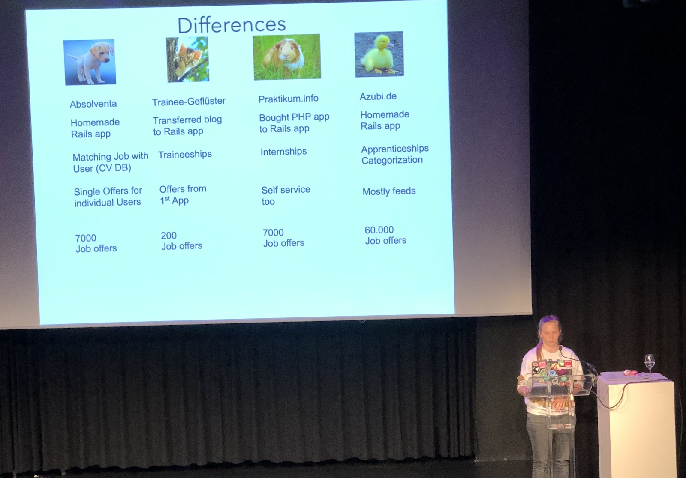
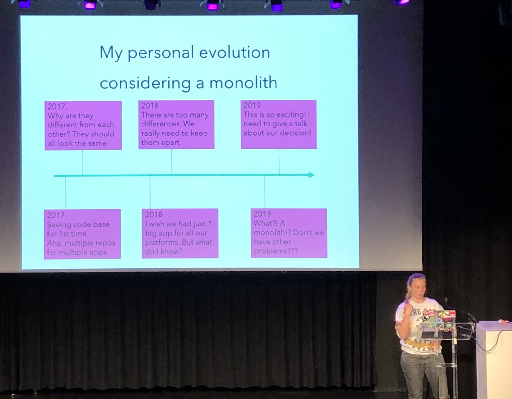

[👈 Back to all talks 👈](../README.md)

------

# From multiple apps to Monolith - #BuildingMonsterservices

## Kaja Santro [@AlizeNero](https://twitter.com/AlizeNero)

We will learn about why and how to move all applications into a single monolith repository.

During a course of a few years there have been 4 different apps created. All of them were Rails apps and all of them were Job Board kind of application. They all seem similar, but are slightly different. The main difference was the type of content that was there. 

One of the issues was that trying to fix any bug on frontend required similar changes to all codebases, which required a lot of human work. Adding new backend features caused similar issues - it had to be done in each app separately, and led to inconsistencies in implementation. There were even issues such as different field names in JSON APIs.

There was also one more issue. There was a single tool that fed job offers data to all aplications. Each application had its own “messages assembler” responsible for extracting required data. But it was actually responsible for much more and became more and more complex overtime. 

Thus, the idea to unify applications has been brought up. The CTO suggested to build a single monolith applications out of all of them. 

There were many risks involved with this idea. Throwing all data into same database could easily break existing links and references. Different platforms were using different data for same companies. Also, running the app locally could be a problem with many applications handled by came routes.

The plan was to start with the easiest ones to migrate and gradually move to the hardest one. In the process, some of the libraries have been extracted do microservices.

The outcome is that it’s now possible to save a lot of money on hosting. Every new feature and bugfix is instantly available in all apps. There are less dependencies, because all libraries and tools are now part of the repository. On the other had deployment and tests now take more time, but it’s not that big of an issue.

In the end there was no damage done, and gains were definitely noticeable.

