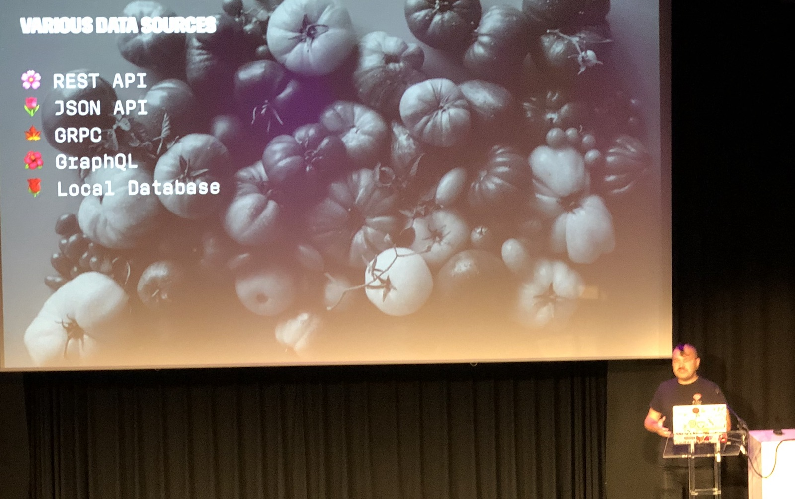
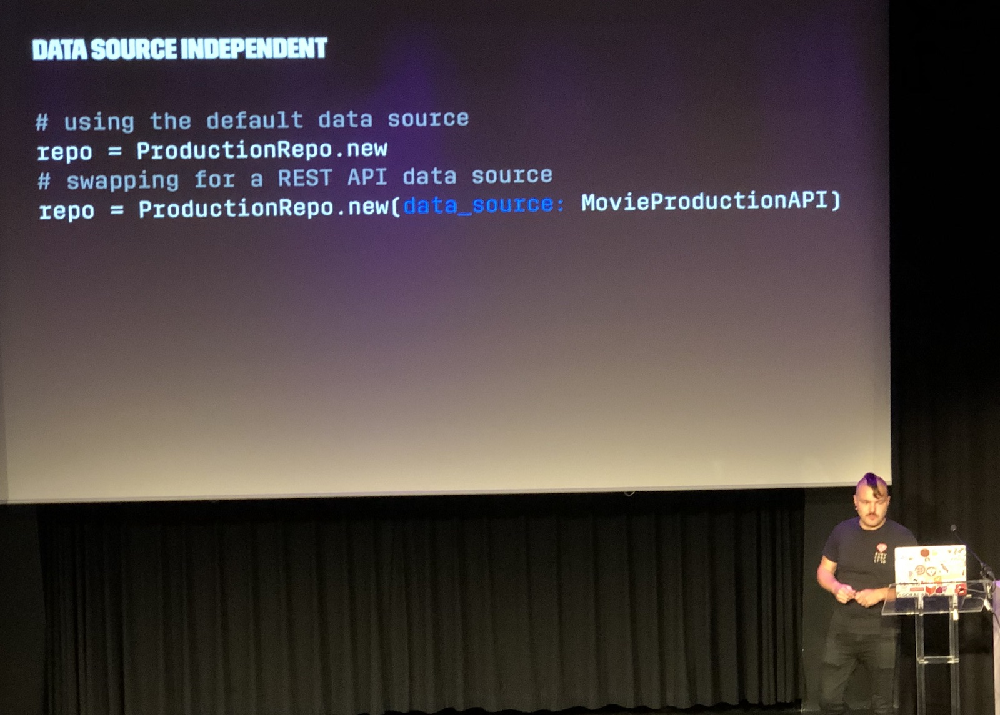
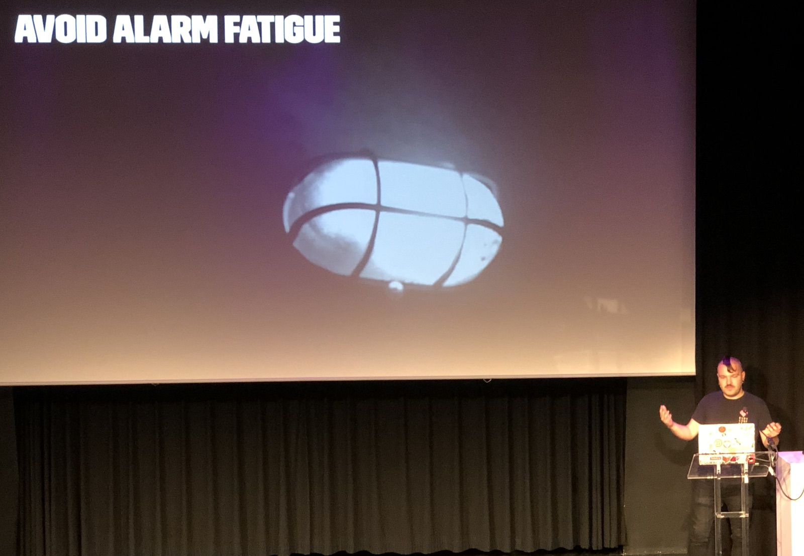
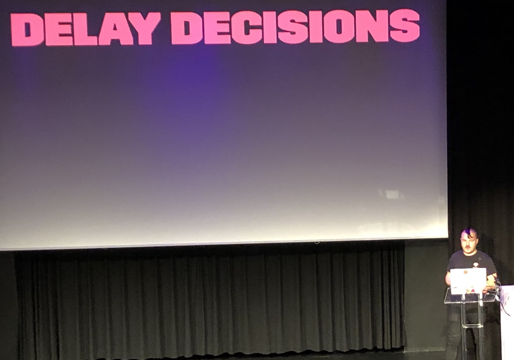

[👈 Back to all talks 👈](../README.md)

------

# Surrounded by Microservices

## Damir Svrtan [@DamirSvrtan](https://twitter.com/DamirSvrtan)

Netfilx started as a company that gave people opportunity to experience ad-free experience and access to many movies and tv shows. Recently Netflix started creating their own series. It turns out that this business is still kind of stuck in a previous era. Netflix creates apps that help them reduce traction and cover every part of production process.

Netflix started as a monolith with Rails application. It has since split into many specialized services. Ruby on Rails is still a framework of choice for building new tools there. Since all apps and databases are distributed, there is some different approach required.

We need an architecture that separates busines logic from implementation details. It’s called a hexagonal architecture. It allows splitting busines logic from all surrounding protocols and impementations. It’s built around Entities (such as a movie, a production etc). They don’t actually care about where they’re stored - it’s ActiveRecord’s job. It uses many Data Sources to handle this. Data Source may be an SQL database, JSON file or just any place that can store data.

Then we have Interactions. They are classes that explicitly state what they do and how the handle business logic. How do we build all this?

For Entities we can use dry-rb and their stuctures. For Repositories a custom DSL layer is used. It helps route requests into responsible Data Sources that all implement the same interface. Implementation details never leave Data Source. It allows changing Data Source at will without having to do any changes in Repositories or Business Layer.

For Interactions there is an Interactor gem. Interactor gets a Repository throurh Dependency Injection, so we never mix Business Logic with Persistence. This is not exactly how Rails does things, and actually Hanami will be better suited for this. But Rails still has a lot of useful gems (such as counters culture) that make it more viabla choice.

How do we crate a data source that is dependent on extrenal data? One way would be to create an API client for each required integration. But it’s better to have autogenerated clients. This can be achieved by having each API follow some documentation standard that allows generating clients (such as Swagger).

Whe your only data source is the database there is a single point of failure. But with many data sources there are many places that can fail. Networks are unreliable and we must be prepared for an outage. This can be done by doing proper graceful failure and having proper logging in place.

In order on to get overwhelmed by your services it’s important to have metrics in place. Of course you can’t proceed without Error tracking. But we don’t want to be overwhelmed by all kinds of errors - we only want the ones that are actionable and be can do something about them. We don’t want to experience “Alarm Fatigue” - having too many alerts will lead to people ignoring them. It’s a good idea to have some kind of a threshold setup.

But does it scale well? In the end we add a lot of network requests to our applications. Before we answer this we should try to find a sweet spot in consistency--availability spectrum. Shops sucha s Apple or Amazon will always focus on availability, because it’s important for them to ell stuff. But in our case we may prefer to have consistent data over having better availability. With microservices we can delay having to make big decisions until we actually need them. It’s easy to switch databases and technologies, because or application is not tightly coupled.

Then there are tests. Tests must be reliable and fast - we don’t want to have to run them only on CI server. Usually we test Rails applications by hitting the database, because the database is coupled into implementation. With Dependency Injection it’s easy to test Interactors without heving to use database - we can supply it with any Data Soruce we want. But it’s only for Unit Tests, what about Integrationspecs? There are two layers. FIrst one is checking if we’ve properly integrated with other services. Second one is basically running requests with external services calls stubbed out.

