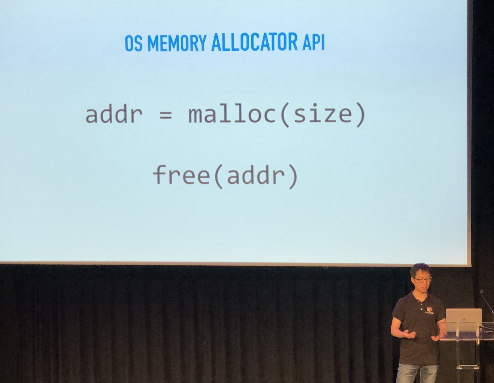
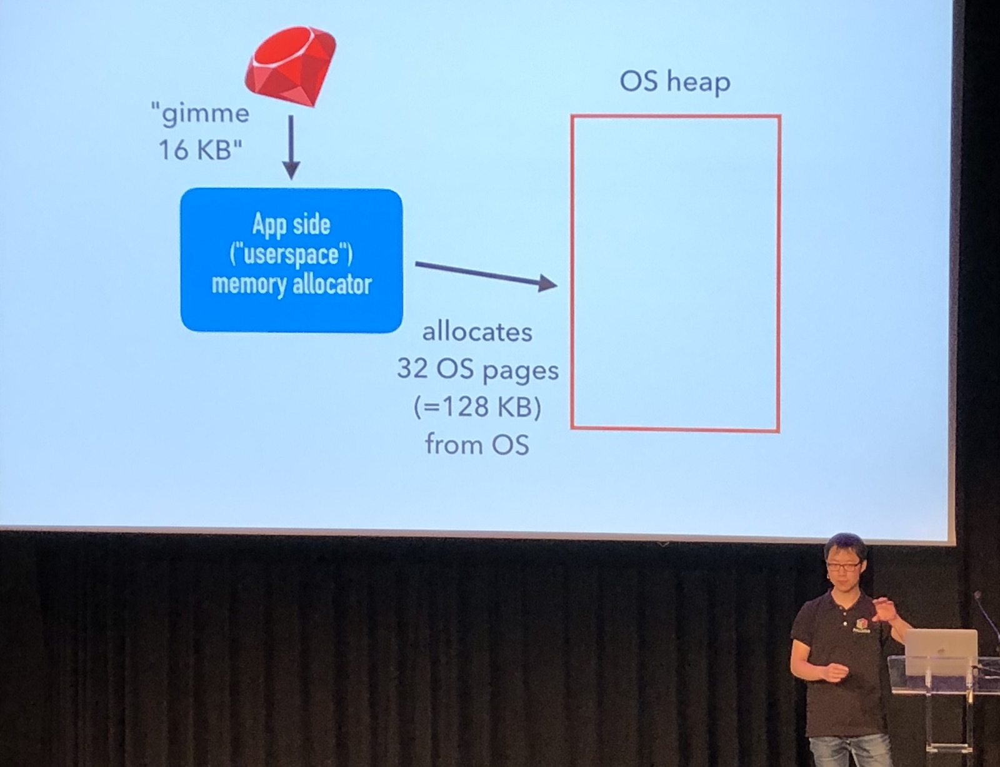
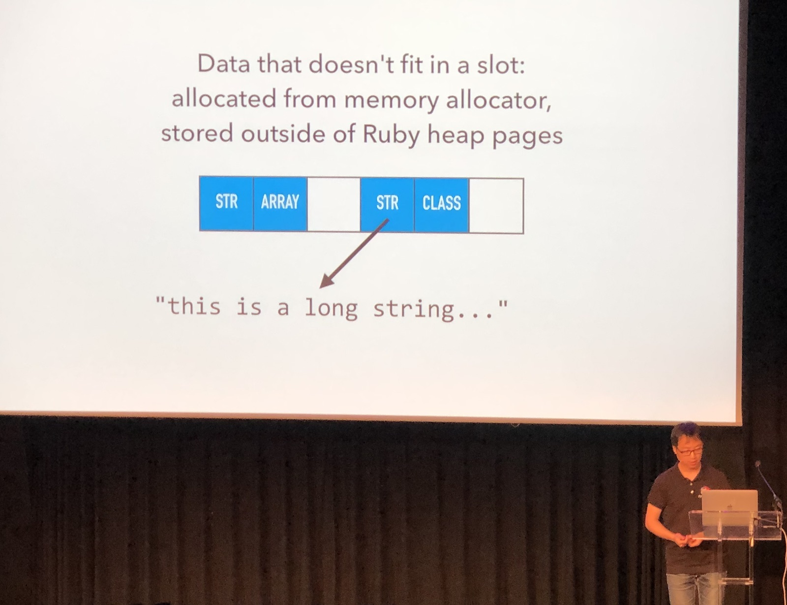
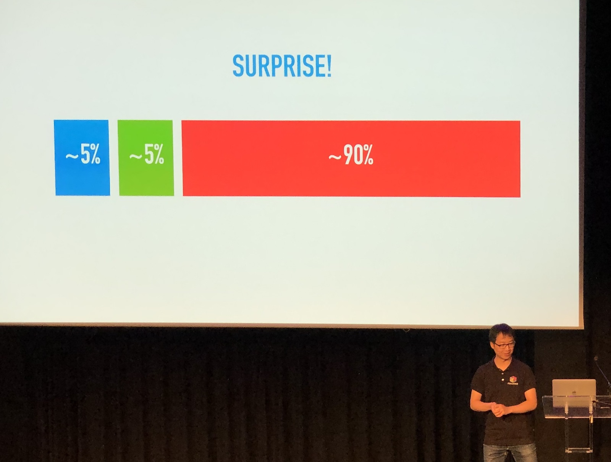
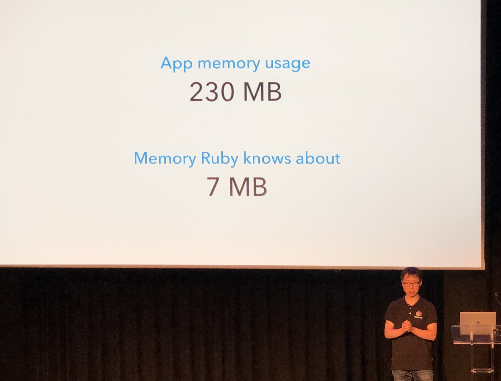
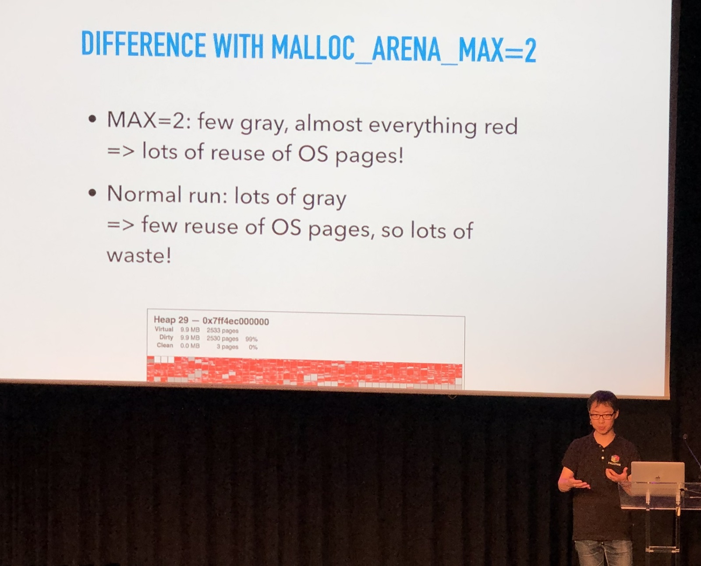

[👈 Back to all talks 👈](../README.md)

------

# What causes Ruby memory bloat?

## Hongli Lai [@honglilai](https://twitter.com/honglilai)

Phusion created Passenger, which is a Ruby app server. A simple Ruby application may grow to 1.3GB memory usage overtime. There are rumours about Ruby memory bloat comming from memory fragmentation by malloc. The recommended solution is to use different memory allocator.

We will learn about how memory allocation work, why does bloating happen, and what can be done about it.

The problem we’ll talk about only occured in multithreaded applications running on Linux. No other setups were affected. Ruby is not the only one that has this problem.

1. How does memory allocation work?

   Our opperating syste provides us with methods that allow us to request and free certain memory pieces. But deeper inside, allocator has two different parts. There is user space, but there is also OS kernel space.

   

   Memory in kernel space has to be allocated in chunks called pages (4KB in Linux). In User Space it’s possible to allocate any size of memory piece, but it is also divided into pages.

2. How does Ruby manage memory?

   Ruby allocates objects in groups. It’s more efficient to do a single malloc for a group of objets, caller a “Ruby heap page”. Ruby splits this heap page into equal pieces of 40 bytes.

   

   If something doesn’t fit into this heap page (for example strings), we store it outside of a heap. So we have two different types of memory in Ruby. There is Ruby heap page and there is data stored outside of heap. But it turns out there is a third type of memory that occupies the most of all.

   

   Ruby seems to only know about the first two pieces, but the operating system will report much higher memory usage. What is this third memory part?

   

3. How memory allocator handles multithreading?

   In order to allocate memory efficiently, there is an OS heap for each core. Doing multithreaded application should not increase memory usage - it should just get divided into multiple heaps. But does it? In order to do this we need a tool that lets us easily visualize OS heap tool. Since such tool doesn't exist yet we can create one.

   

   By looking at this we can see that memory is highly fragmented. There are some OS pages that are only partially occupied, but they still use 8KB. Most of OS pages are actually entirely empty. 

4. What can be done about it?

   By using `MALLOC_ARENA_MAX=2` we achieve much higher reuse of OS pages.

   

   There is also a function called `malloc_trim` that forces freeing OS pages. When we integrate it into Ruby GC we will highly decrease fragmentation and empty memory pages. 

Memory allocator doesn’t free memory back to kernel by default, because allocating it again may be an expensive operation. On the other hand, freeing unused os pages causes some performance drop, so it’s not as easy as adding it into GC routine.

There is also alternative allocator called Jemalloc that gives similar memory savings and is faster that forcing malloc to free memory. But it has it’s issues as well.

All this work will be incorporated into “Fullstaq Ruby” - it’s goal is to be faster, use less memory and use both jemalloc and `malloc_trim`. You can already give it a try on https://fullstaqruby.org.

