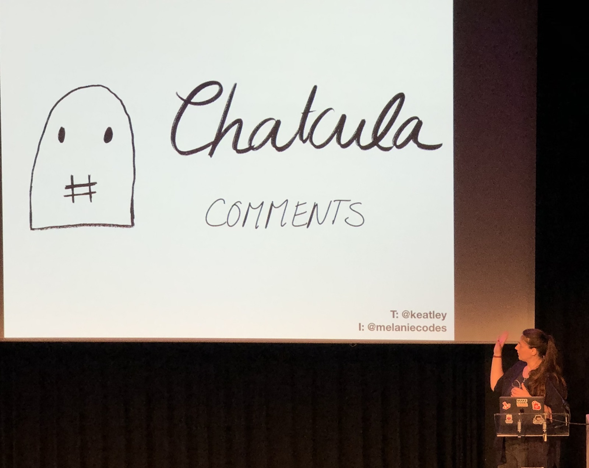
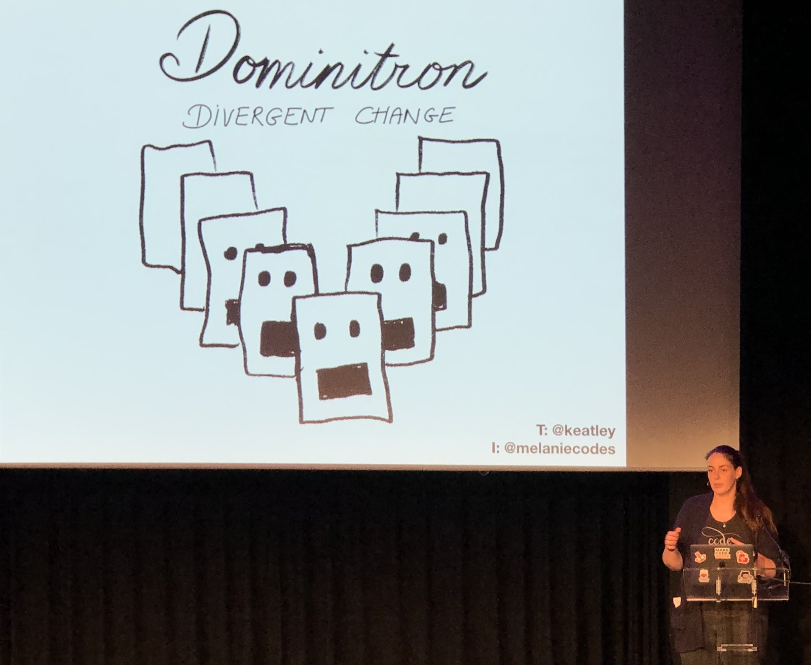
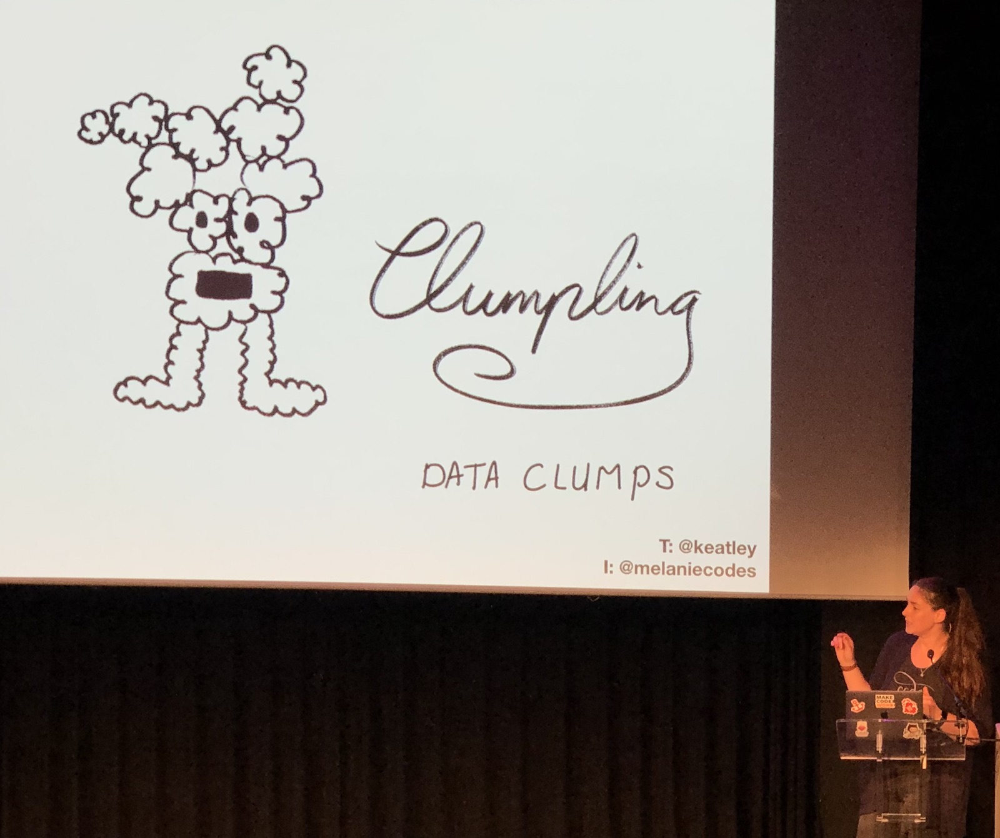
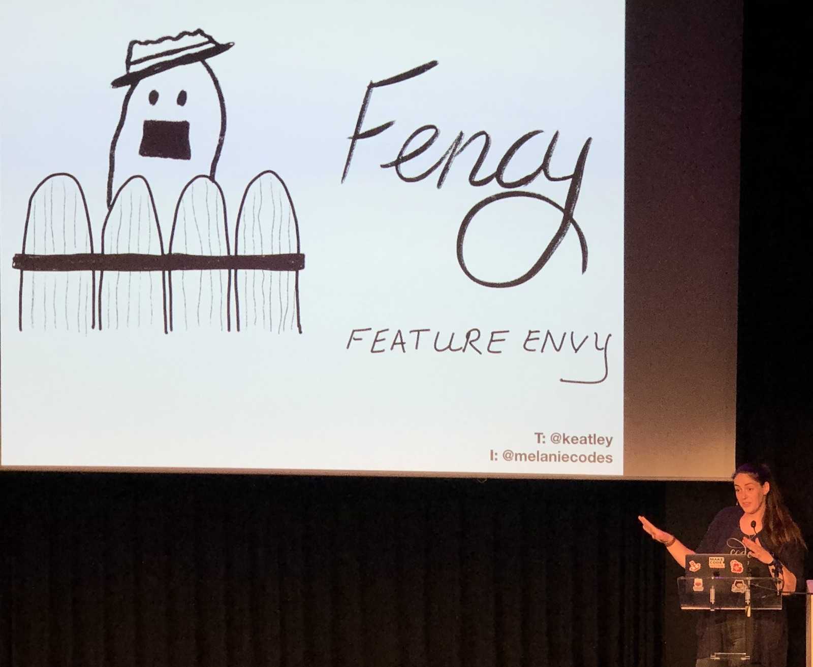
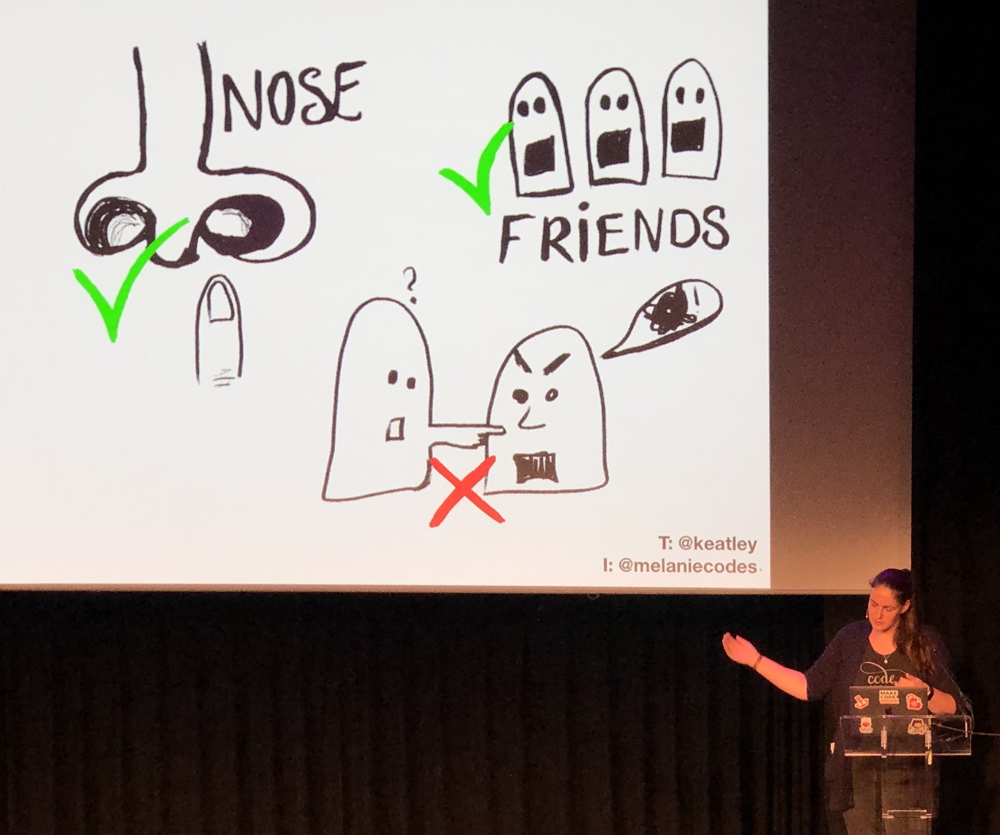

[👈 Back to all talks 👈](../README.md)

------

# It's very effective; using Pokemon to catch all code smells

## Melanie Keatley [@Keatley](https://twitter.com/Keatley)

We will be talking about Code Smells. This is heavily inspored by Sandi Metz and Martin Fowler. Martin’s book is written in a way that looks similar to a startegy guide. What if we try to look at this through the Pokemon universe? Let’s try to describe Code Smells with imaginary characters. Let’s go though them

1. Dispensables

   Those are the things that you can easily get rid of. The first one of such things are comments - they are not bat by them selves, but  they often indicate unreadable code.

   

   We have to look at data clases and duplicate code as well. Next groupy we can focus on is a lazy class. Those are classes that are not really useful.

2. Change preventers

   

   This is another grup of code smells. Sometimes there are too many dependencies to easily refactor something wihtout having to change everything else.

3. Bloaters

   

   Those thing make your code less readable. Long methods, long parameters lists and data clumps all prevent your code from being easy to work with.

4. Couplers

   Feature Envy classes make your code tightly coupled. A single class knows way too much about all other classes.

   

   Message chains can be a big problem when you want to change a single piece - it requires you to change all that follow it.

5. OO Abuses

   Abusing object oriented architecture will cost you money - people will have trouble understanding how it works. For example creating two alternative classes that have different interfaces - they are not easily interchangable.

Let’s think why does drawing characters may help us remember and understand complex tobpics easier? According to research from 2016 drawing things help you remember things almost twice as good as writing them. And the picture quality desn’t really matter - just the fact of drawing it is enough. It is believed to be related to reduced stress when drawing and increased relaxation.

We should try to use drawings to explain complex topics. It’s easier to remember and may be understood better.

