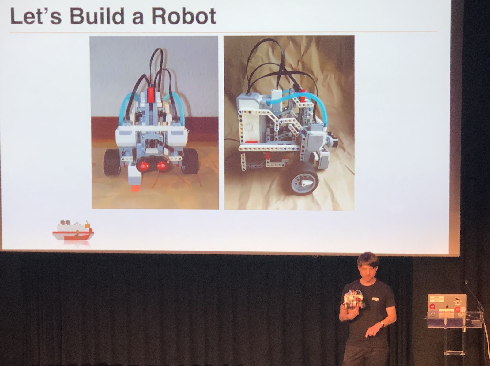
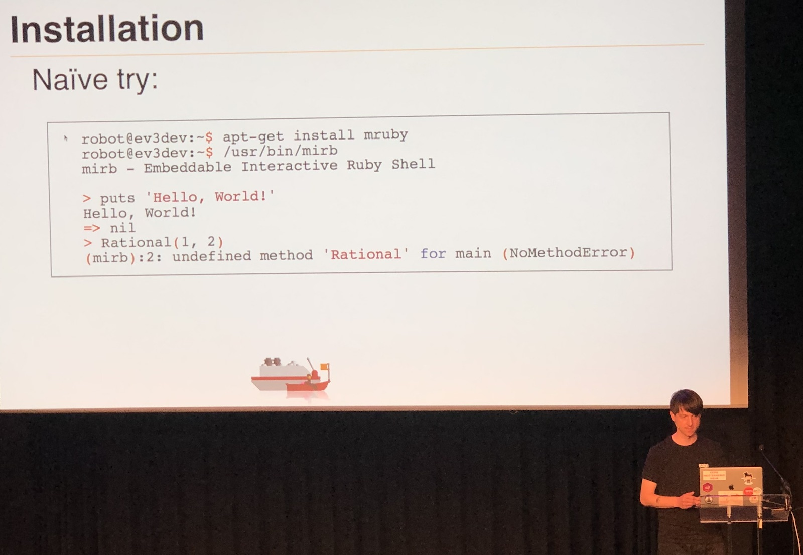
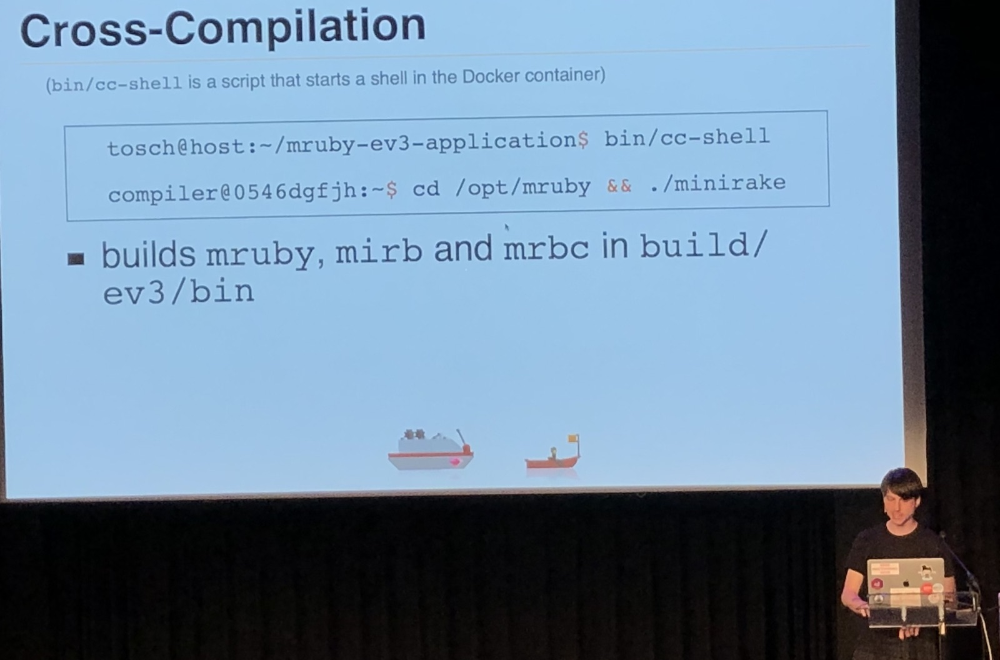
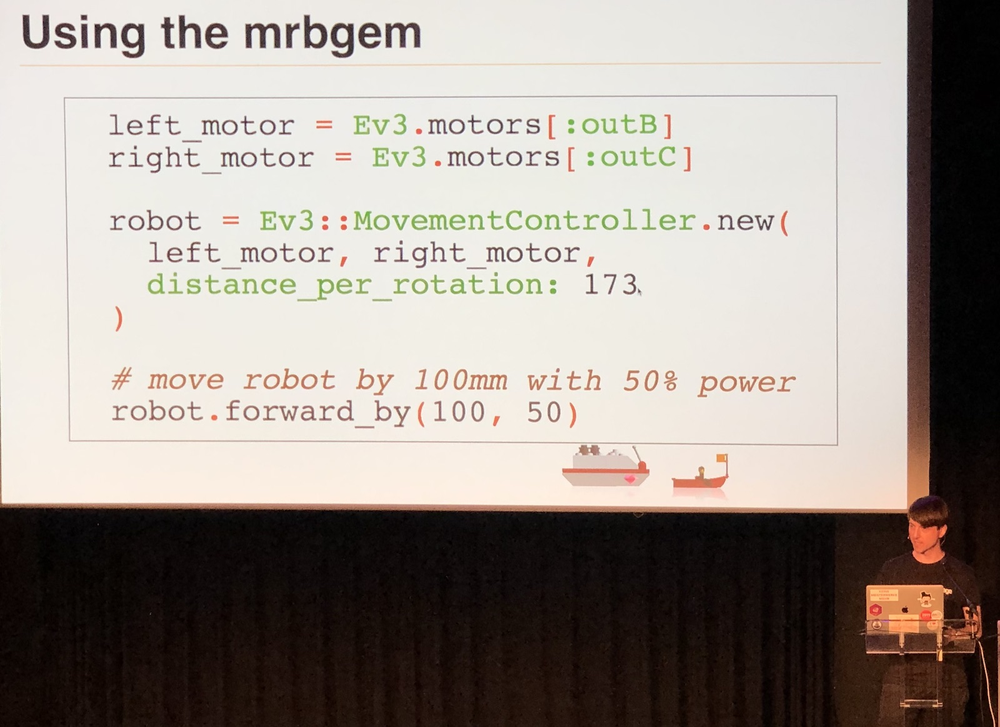
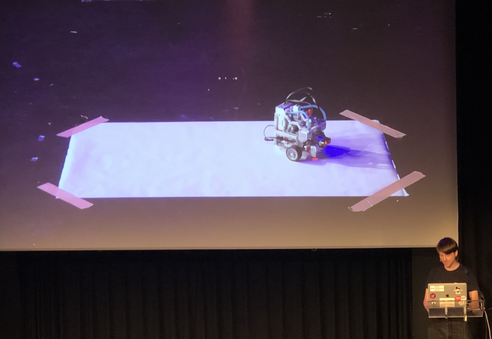

[👈 Back to all talks 👈](../README.md)

------

# Building bricks with MRuby: A journey to MRuby on LEGO robots

## Torsten Schönebaum [@radlepunktde](https://twitter.com/radlepunktde)

The best way for people to learn is by playing. We do this since childhood. Once we get older there is a great tool for us to learn by playing - LEGO Mindstorm. We get all kind of sensors that we can use to build a robot.

Mindstorm has an ARM9 based CPU and 64MB of RAM - this should be enough for us.

LEGO provides us with an Education App that we can use to program our robot. It’s easy to debug it and build simple stuff. But it’s slow and quite limiting. For example we can’t do a webserver with it. An alternative is MakeCode from Microsoft - it uses JavaScript, but has no debugging. Then, there is also Lignite, but it runs on host, not on Mindstorm CPU.

It turns out there is a Linux distro for Mindstorm. It has drivers for most peripherals and has an SSH server, which is great news for us. We can try programming in Ruby. MRuby specifically, because it’s designed for embedded devices. It has some limitations and lacks some methods from CRuby, but has a much smaller memory footprint.

We have to keep in mind that Mindstorm’s CPU does not support floating point operations. We’d be quite limited there. Also, in order to use gems we have to compile them into our MRuby installation. But compilation on our ARM CPU takes ages. Thankfully, we can use cross-compilation to use desktop CPU for building ARM binary.

In order to interact with our sensors we use `ev3dev` drivers provided by our OS. It is done by reading and writing data to text files that represent our sensors. This is something that Ruby can do with no issue.

We can then pack it all into mrbgem that we can use to easily control our robot. We can even add some helper methods that help us for example move a robot by a specified distance.

There were some difficulties during the process. Sometimes it wasn’t obvious which methods were missing from MRuby. Also when loading files it’s important to keep note about their order, because it does make a difference. Instead of breaking big code into smaller files it may be better to create small mrbgems.

In the future we may see support for concurrency, so we can easily handle events like a keypress. There is also a display that requires some C code to use Linux framebuffer.

