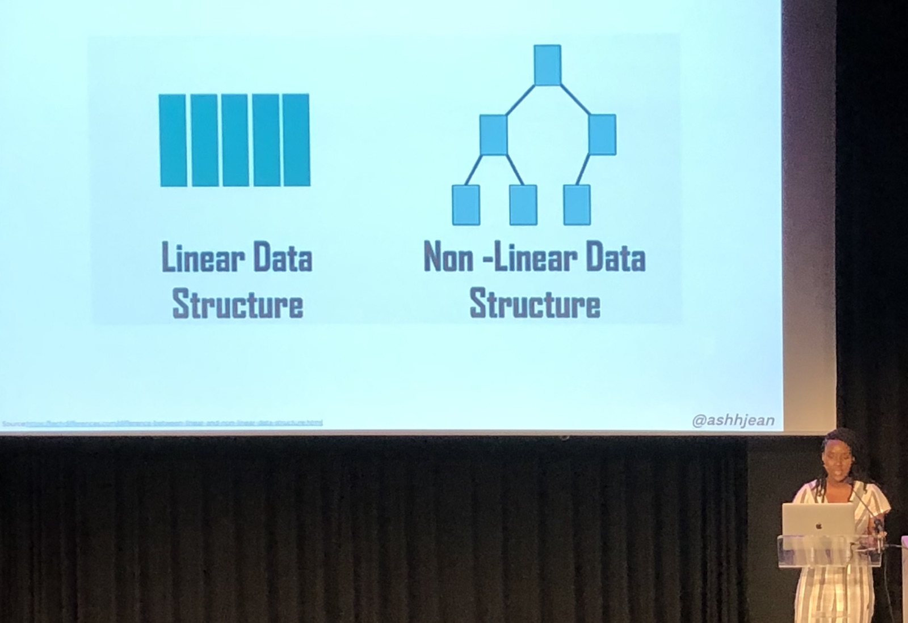
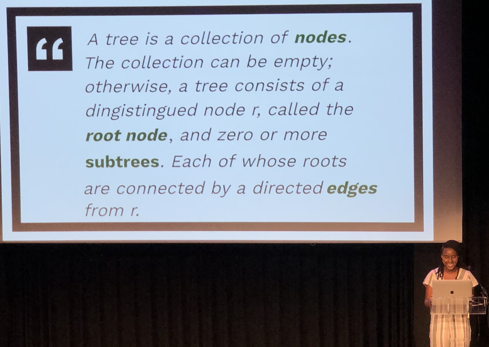
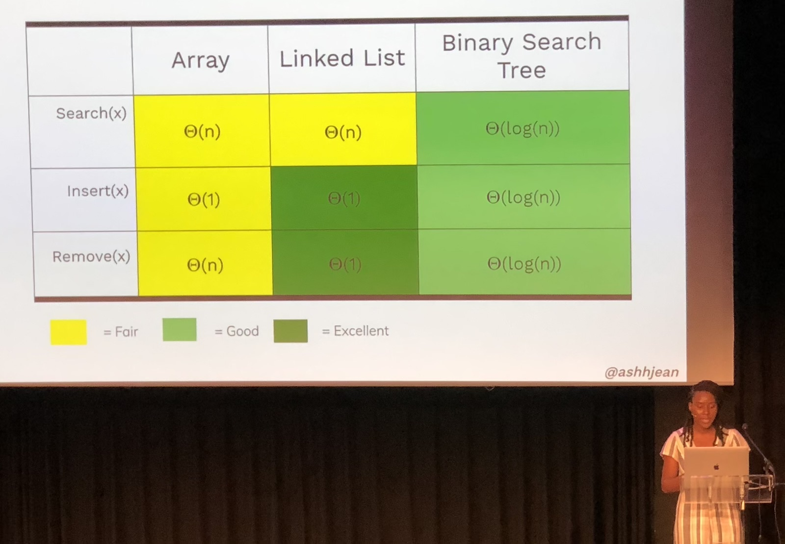
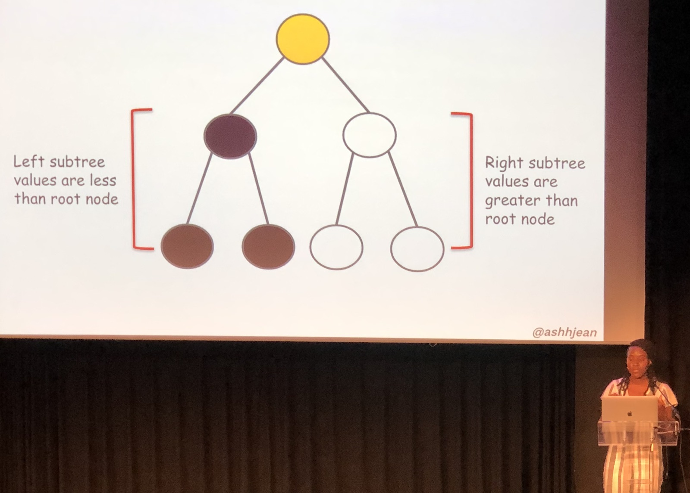
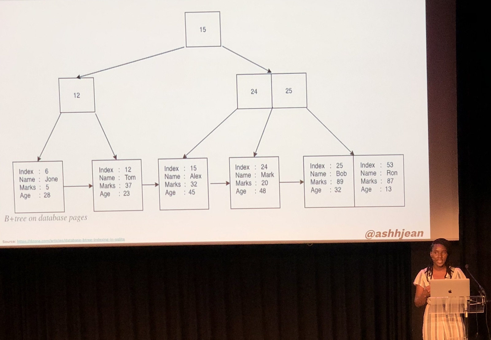
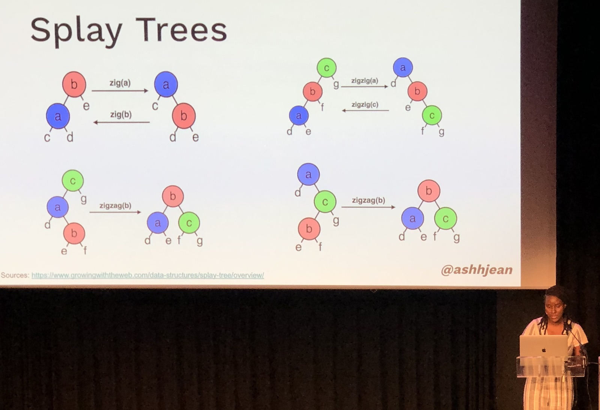

[👈 Back to all talks 👈](../README.md)

------

# A gentle introduction to Data Structure Trees

## Ashley Jean [@AshhJean](https://twitter.com/AshhJean)

We’ll learn about Trees. Why are they useful, how are they relevant to us and we’ll see different examples of this Data Structure.

There are two types of Data Structures. The first one is a Linear Data Structure such as an Array, or a List, where each item is linked to a single, previous item. In Non-Linear Data Structures elements can be connected in many different ways. A Tree is an example of Non-Linear Data Structure.

There are 4 important topics when we talk about a Tree:

1. Node

   Node is a structure that holds our data. The Node at the beginning of a Tree is called a **Root Node**

2. Edge

   Endge is what connects Nodes together. Nodes below onther Node are called “Children Nodes”, while the node above is a “Parent Node”

3. Subtrees

   We can see at any node and it’s descendants, and it will also be a Tree. A subtree of a bigger Tree.

4. Leafs

   Leaf is a Node that has no Nodes under it

But why should we use Trees? They are great choice fro storing hierarchical data such as a file system data. We’ve got folders, that have subfolders that have files in them. DOM is also a Tree - each element has a single parent, but may have many children.

But why should we care? The most important thing is performance. Trees are really efficient in what they do.

A specific type of Tree is Binary Tree - a Tree where each Node may have no more than 2 Children. Then, we can change it into a Binary Search Tree, where all nodes in left subtree are smaller than all nodes in right Subtree.

How do we navigate through Trees? There are four strategies for doing this: Pre Order, In Order, Post Order and Breadth First Search. But we don’t need all of them right now. We’d only like to know how to navigate through Binary Search Tree to achieve faster search time.

Then we have B+ Trees that may have more elements under each node and allows easily storing huge ammount of data.

But there is one more thing we need for our BST to be efficient. It must be balanced, which means that laft and right subtrees have similar number of nodes. We have some more advanced structures, called Selft Balancind Trees for this. One of them is AVL Tree. Another one is Splay which rebalances each time a Node is accessed. A B+ Tree is also a self balancing one. 

Now that we know the basics, we can try to learn more on our own.