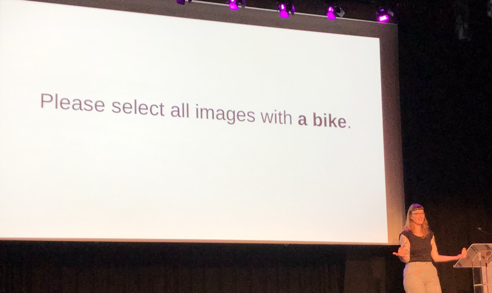
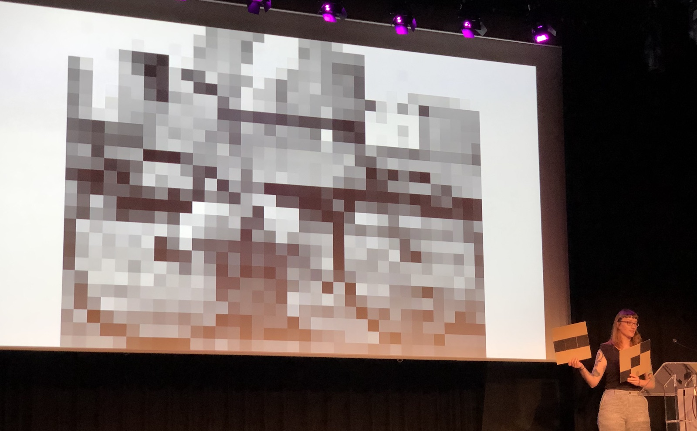
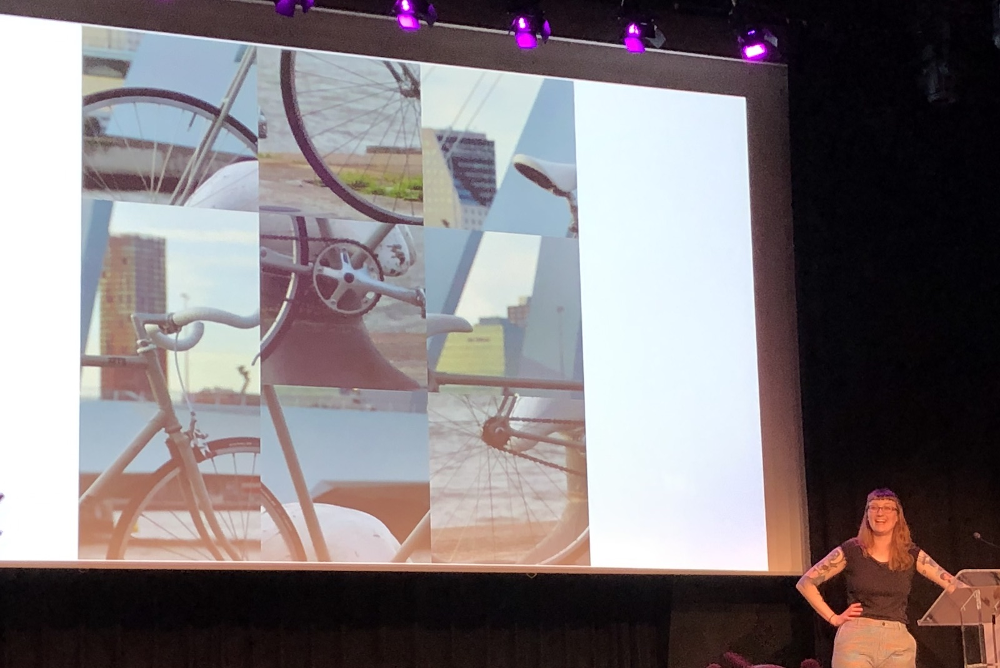
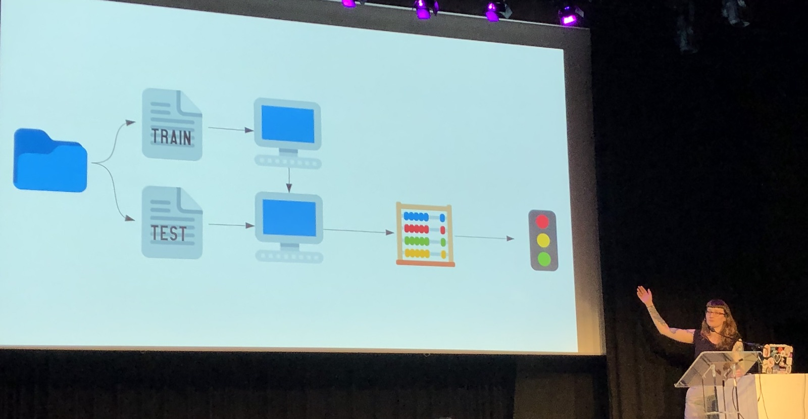
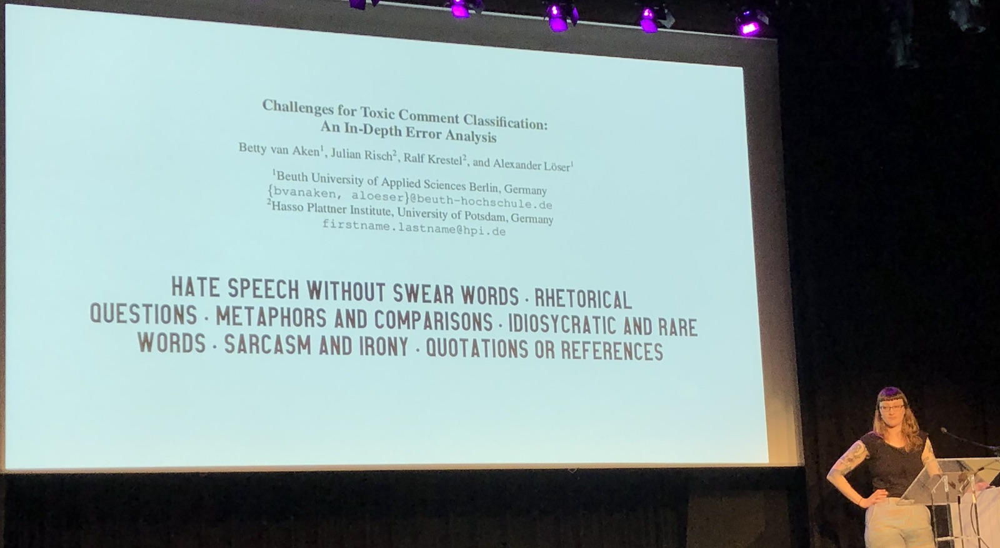

[👈 Back to all talks 👈](../README.md)

------

# Closing keynote: The Miseducation of This Machine

## Laura Linda Laugwitz [@lauralindal](https://twitter.com/lauralindal)

We’ll try to revisit a question asked in 1950s by Alan Turing: "Can machines imitate thinking"? We will understand thinking as a process of reproducing knowledge, reusing it for different scenarions and reflecting on the outcomes.

As it turned out in recent years, Machine Learning algorithms are really good at learning bias. This can be found everywhere: music recommendations, recruitment AIs, image recognition. That’s because machines always use the past knowledge to predict the future. This makes data stuck in reproduction process.

Let’s see at how machines may learn to classify images. Image recognition uses pattern matching, so it’s not really looking at the original image, but instead redraws it using custom rules that show how well it matches certain patterns. It won’t be recognisable for humans, but is easier for algorithms to process. Thats how Convolutional Neural Nerworks work underneath.

But this approach has it’s limitations. It’s possible to trick a network into recognising object that is not really in the picture. The network doesnt care about global context.

Overall, algorithms are great for data reproduction and remixing.

But what ebout the last one? Reflection. For example it turns out that recognising hate speech is much harder problem that images classification. How would we approach this from a machine perspective? The best way is to use Supervised Learning.

We feed the network with a set of labeled data, and it should learn to properly label data from outside the set. After training we can check it’s results using second data set, called a “test set”. It’s also labeled, but not used for learning. We only use it to see if networks provides good results. Those results are then used to improve the network.

As it turns out, even with good training algorithms often flag neutral texts as hate speech. There are many language constructs that are not obvious to a machine. So how do people identify hate speech? People have a more practical uderstanding of language and message context. 

But people also fails at this sometimes. Not only can we misunderstand irony, but also some words can change their meaning quite quickly.