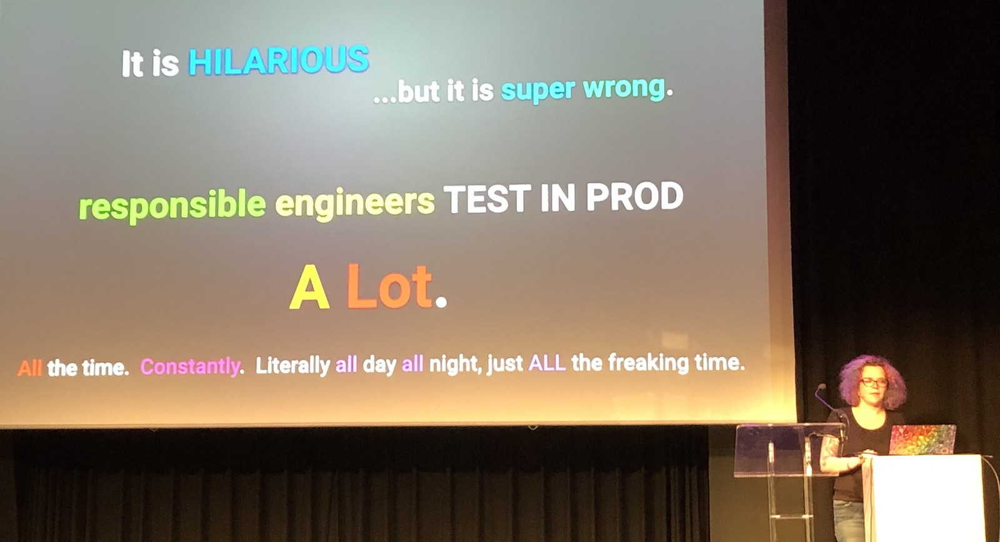
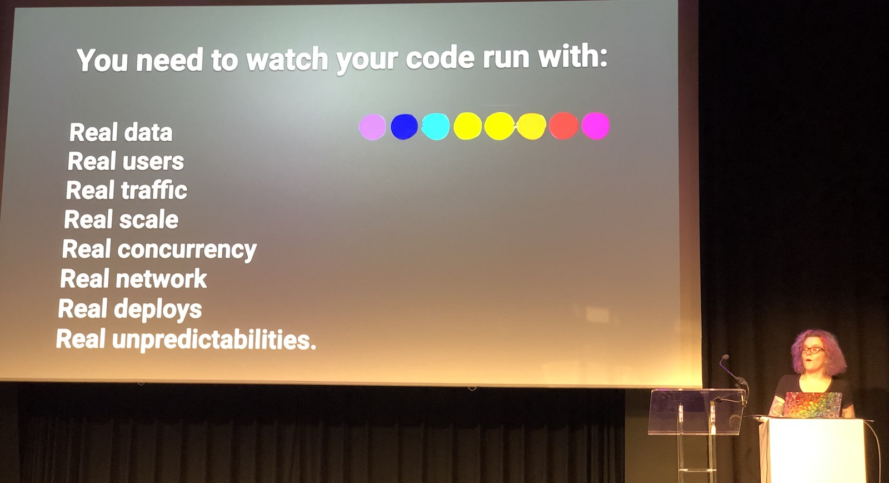
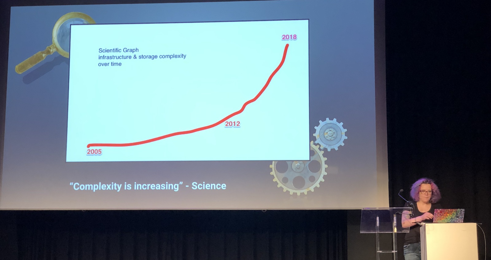
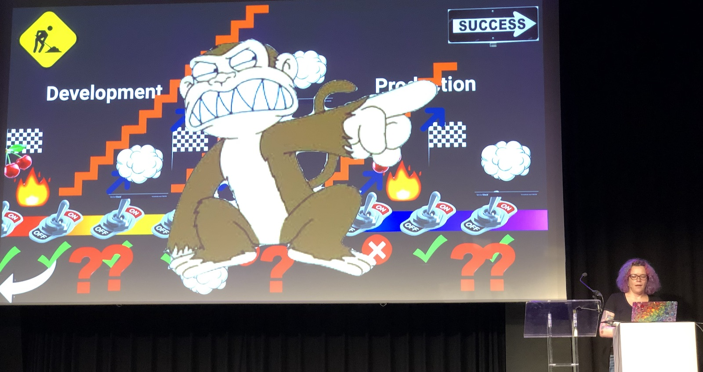
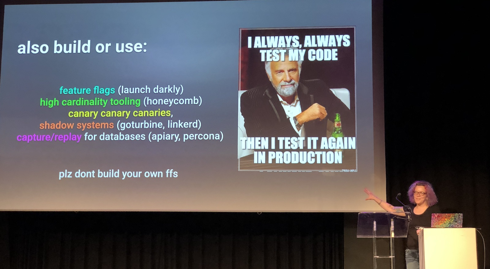

[👈 Back to all talks 👈](../README.md)

---

# Keynote: Yes, I Test In Production... And So Should You

## Charity Majors [@mipsytipsy](https://twitter.com/mipsytipsy)

Testing in production may sound like a bad idea - it got quite a bad reputation over the years. Of course, skipping real tests and just testing in production is not a way to go. It should not be used as an excuse net to have proper tests in place.

Tests are a great way to ensure you don’t encounter problem that you already know about. But the interesting things always happen on production - where your users are. Users are so unpredictable that they can easily do actions that you’ve never predicted. Staging environment may try to clone production, but will still lack users. And it may introduce bugs that never actually happen in other environments, so we end up fixing problems that do not require fixing.

Moreover, spending a lot of time in staging environment may teach you bad habbits. For example you’ll never drop a database on production, but it is ok on staging sometimes.

Our software and architecture will increase in complexity overtime. And there will be more and more things that may, and will fail. But you don’t have to write tests for those situations. You don’t need to test for network outage - you should just fix an issue and move on. In complex, distributed systems it’s impossile to avoid those situations. And we’re all doing distributed systems nowadays. There are many new unpredictable unknowns that simply cannot be covered with regular tests.

And another issue with distributed systems is that you cannot clone or imitate them - no staging to do your testing. There are enough things that may go wrong on production anyway. Why try to add a fake environment that will only consume your time to maintain?

Instead of focusing on testing made-up situations and doing things in fake, staging environment, it may be better to just look at what is going on in production. That’s the most important part of your process, but it’s often overlooked. Especially with Continuous Deployments, feature flags and many different variables it may not be obvious what state your production is in.

In the end the most important thing is that things can break. But it’s ok as long as users don’t see the issue. And there are many great tools that may help you improve your deployment process and make testing in production much easier. The more you do this, the more you get used to working with working code, so it’s easier for you to actually maintain this state.

