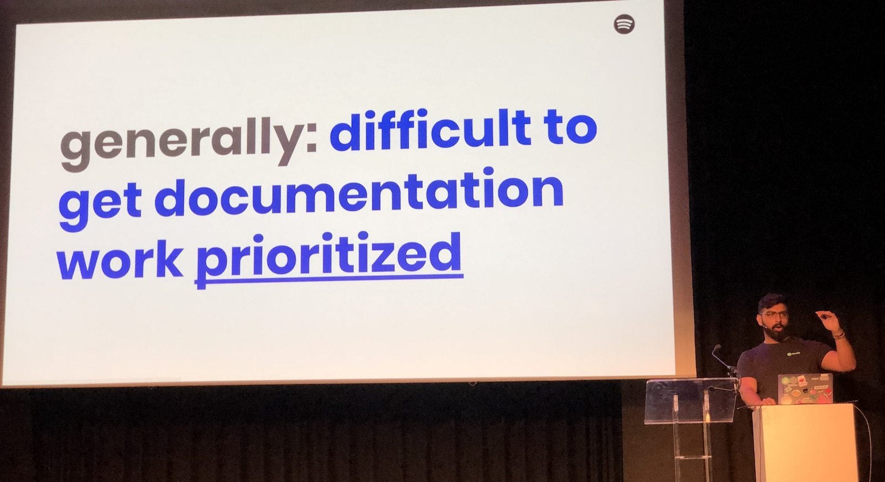
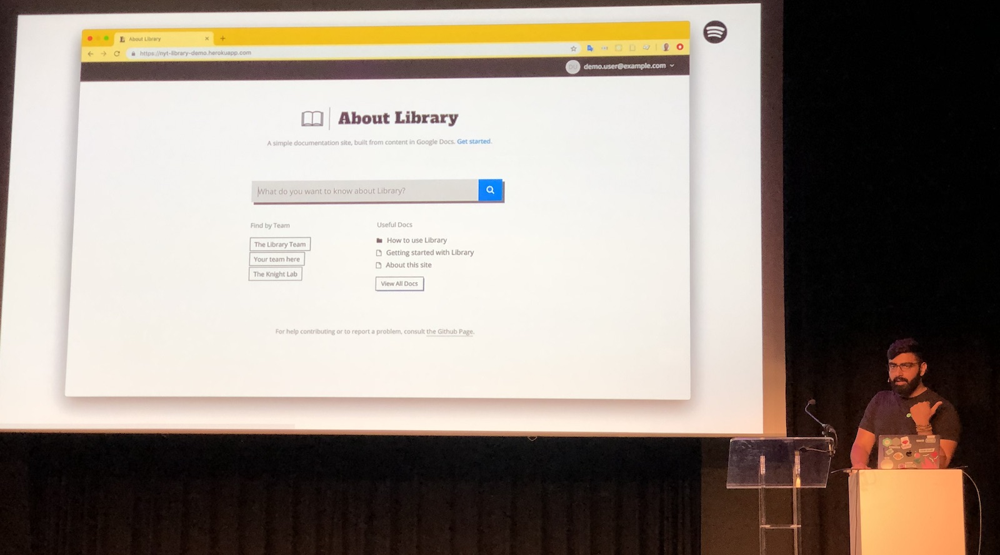
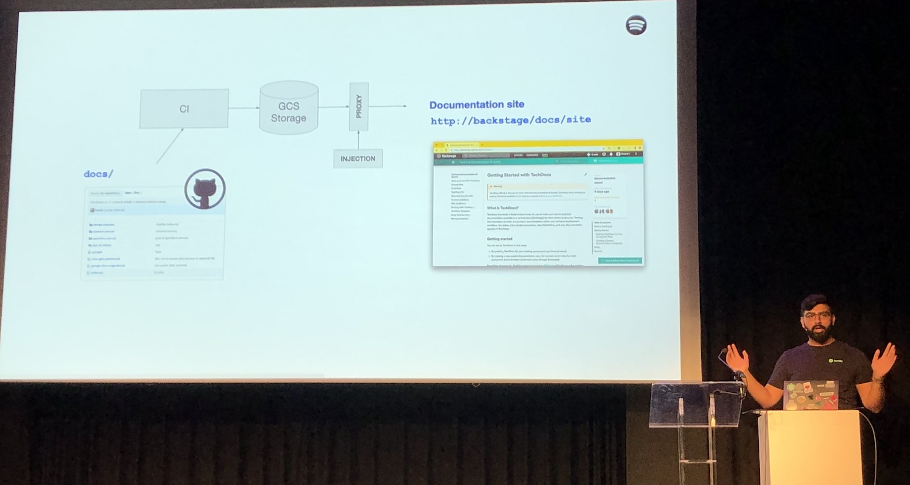
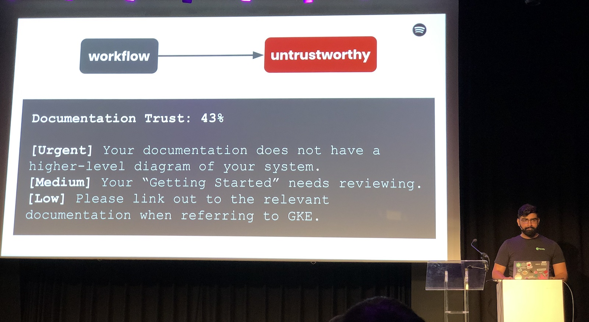
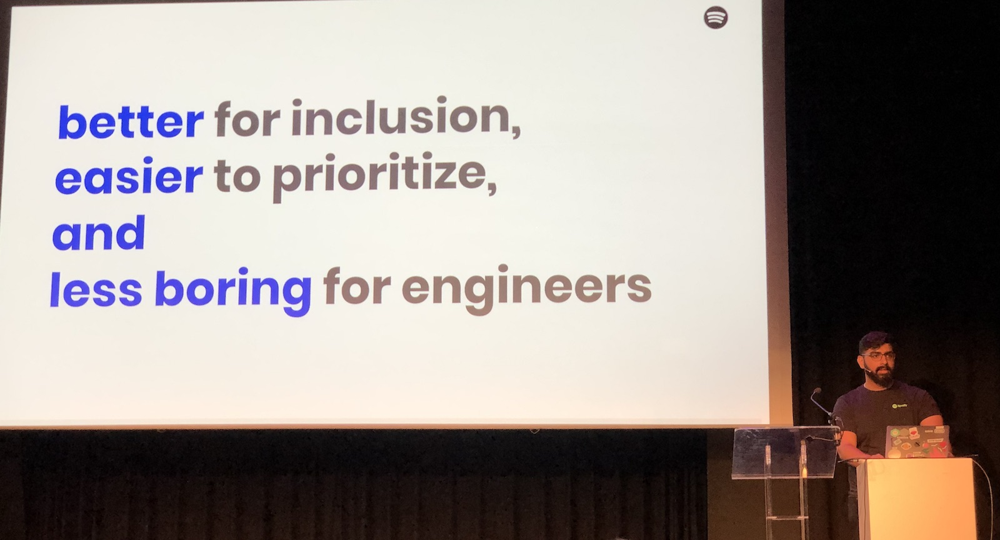

[👈 Back to all talks 👈](../README.md)

---

# How We’re Making Tech Documentation Better, Easier, And Less Boring

## Bilawal Hameed [@bilawalhameed](https://twitter.com/bilawalhameed)

We’ll see at how Spotify is improving it’s internal, technical documentation. We’ll talk about problams with documentation, and how to approach it from another angle.

There are many tools that are supposed to make writing documentation easier. It’s also really easy to publish documentation with existing tools. These are good for usual public needs. But what about internal documentation?

There are a few tools that may be useful for this. There are github pages that are great for creating documentation websites, but it may be a bit too much for internal needs. What about github in general? You can write readmes and wikis, but they are often forgotten and never updated. Than, there is confluence, but it’s not really a tool for technical documentation.

And in the end writing documentation never gets assigned any time. Nobody wants to spend time doing this.

In the old days, teams used to have engineers accompanied by QA, Tech Writers and DevOps. But with tools like kubernetes we no longer need DevOps and QA - it’s just something that engineers can learn and use tools to aid them. So, we’re usually only left with engineers nowadays.

But why don’t people write documentation? First of all is high entry barrier - if you’ve never done this it may be hard for you to do so. Then, there is an issue with actually finding stuff in the documentation and maintaining it. Would you really trust your documentation? Why should others? Spotify has been trying to tackle the issue for 6 months.

One thing that is great about documenting projects on github is good, because your documentation is close to your code. This seems like a good place to get started, but you can’t really improve github or add your own ideas to it.

On the other end there is a tool called Library. It creates documentation from your regular google docs documents. It’s more extendable, but it’s not connected to code in any way.

It seemed like no existing tool was right for the job. Here’s how Spotify approached it. Starting from “Docs Like Code” idea, they built a tool called TechDocs. It’s build around open source libraries. It tries to solve problems like old, unmaintained documentation, ease of writing by introducing documentation into your usual build pipeline.

This way, they solved a problem with high barrier of entry to writing a documentation. Now it’s standardized so you write it the same way everywhere. Using standards also helped with poor discoverability. It’s now obvious where you should look in the documentation or how to explore it, so the issue doesn’t exist anymore. The last issue was untrustworthyness, which can also be solved by standardizing. Once we teach people how to create good documentation then that problem just goes away.

Another thing that helps tackle those issues is having a good workflow. When your documentation updates automatically on CI, then you have no issue with entry barrier. People don’t have to do anything to publish the documentation - it happens automatically. It also helps with discoverability, by having predicatable urls and integrating good search tools. And how about trustworhiness? The idea is to have a tool that tells you about problems with your documentation. Once you follow the guidelines you’ll end up with high quality documentation.

It turned out to be a success. People have been using documentation extensively, and even started submitting feedback to other teams.