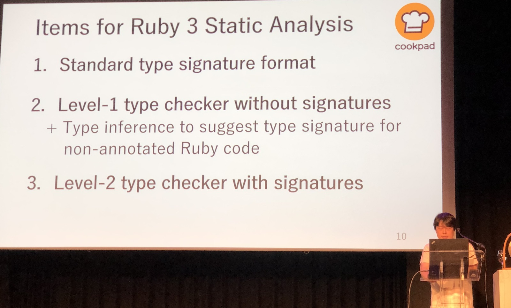
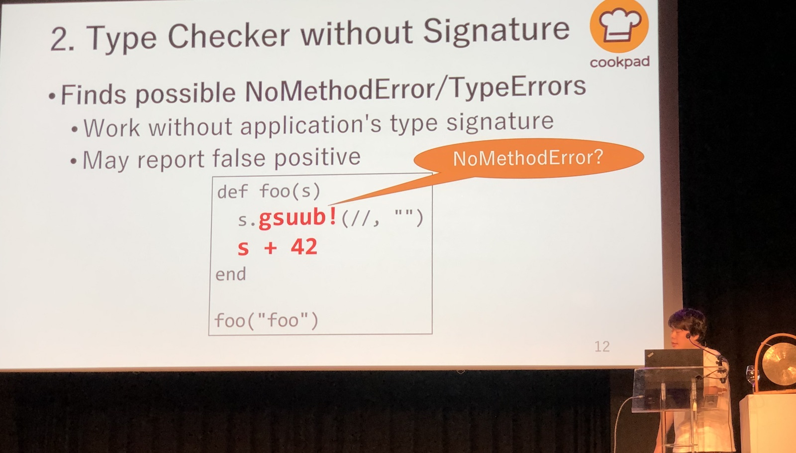
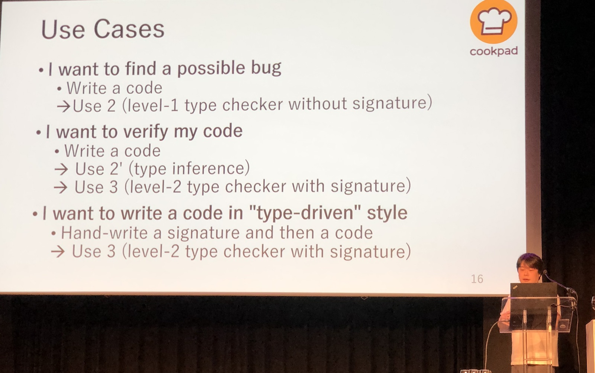
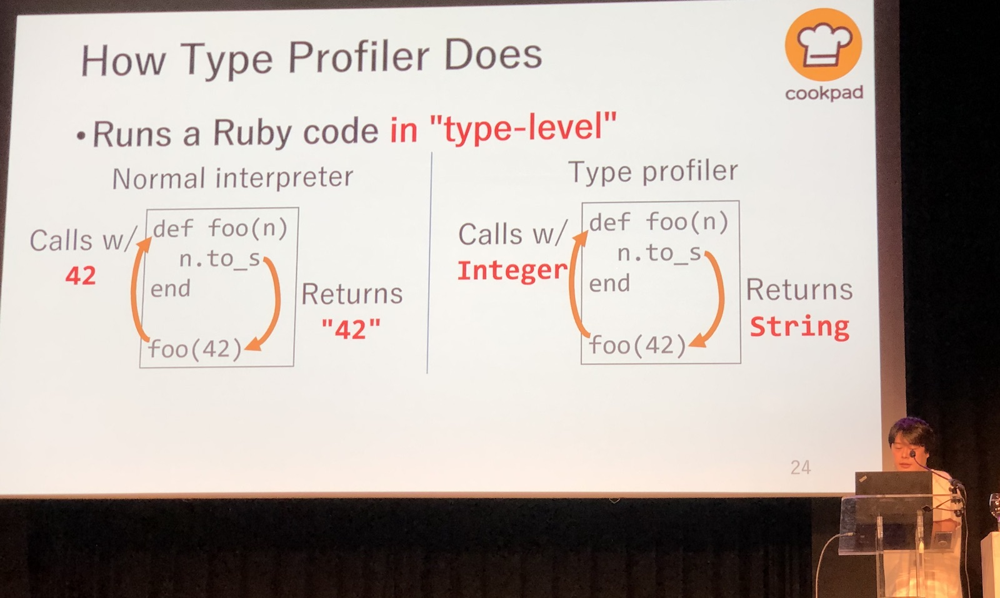
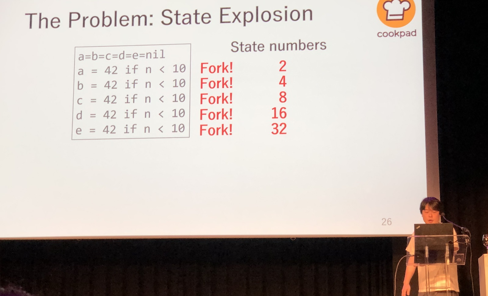
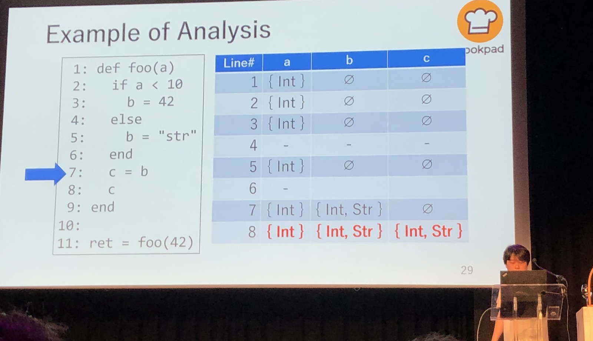

[👈 Back to all talks 👈](../README.md)

---

# A Plan towards Ruby 3 Types

## Yusuke Endoh [@mametter](https://twitter.com/mametter)

Ruby 3 is still a work inprogress, but it’s scheduled for release in 2020. There are 3 milestones for Ruby 3: improved performance (Ruby 3x3), better concurrency and static analysis. We’ll learn about plans for typing.

Matz’s plan for types in Ruby 3 is to add type checking without changing how Ruby feels. The main objective is to allow finding possible type bugs much easier without sacrifising Ruby experience. That’s why type annotations are not required, but merely an option.

There are supposed to be 3 types of type checking.

1. Type Signature Format 

   It’s a separate file that describes parameters and return values of methods. It allows using many different features, such as mix-ins optionals etc.

2. Type Checker without Signature

   It tries to find possible method errors and type errors without having type singature. The problem is that it may report some false positives. There is also an idea of suggesting prototypes for signatures without having annotations. 

   

3. Level 2 type checker with signatures

   It verisies that code compiles with signatures. This is already implemented is a few different proposals

Ruby 3 static analysis will consist of a few items. Libraries with type signatures will be put through type profiler which will help type check application code. Having different type checking options available allows us to have different approaches to creating typed code. We can choose right tool for the job we want to do.

Ruby 3 will ship with type signatures for all standard libraries. Type checkers will be optional and available as external gems.

Let’s focus on Type Profiles. It can be used for checking your code to find typos. It’s also useful for inference and generating type signatures from existing code. To achieve those tasks it runs Ruby code in “type level”. Instead of using values for execution it uses their types and tracks how they change.

The hardest part there is code branching. In “type level” execution we don’t know what value will be assigned to the variable, so we can’t tell which branch will be chosen.

To resolve this, we need to fork the execution and check all available execution paths. The problem with such approach is that paths number increases exponentially with each `if` statement.

We can improve execution time by doing some optimizations that let us run profiler iteratively until we know all values. This approach let’s us avoid exponential increase in branches count.

It gave a huge performance boost that improved execution time form 6 minuts to a few seconds on optcarrot code.

There are still a few problems with type profiler. It can generate false positives, still needs some testing and some ruby features are not handled by it. It’s impossible to type profile `send` calls.

Type profiler is open source and available for testing.