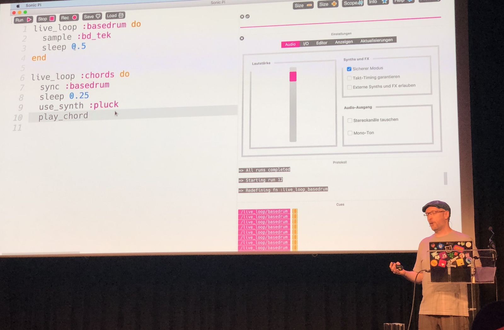
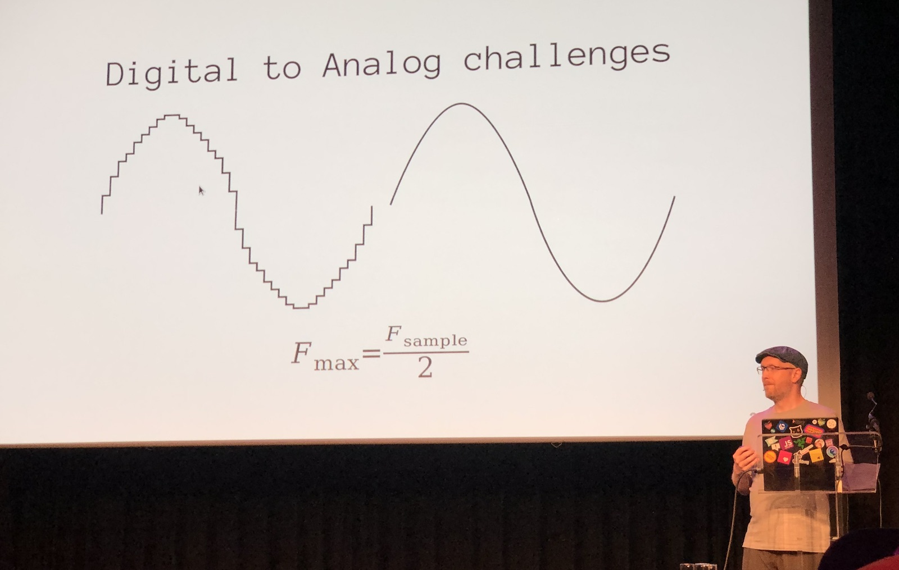
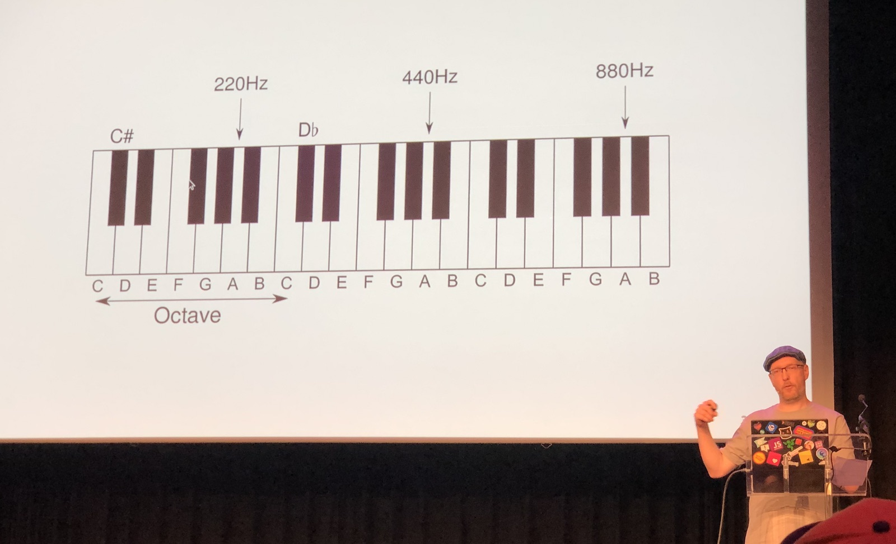
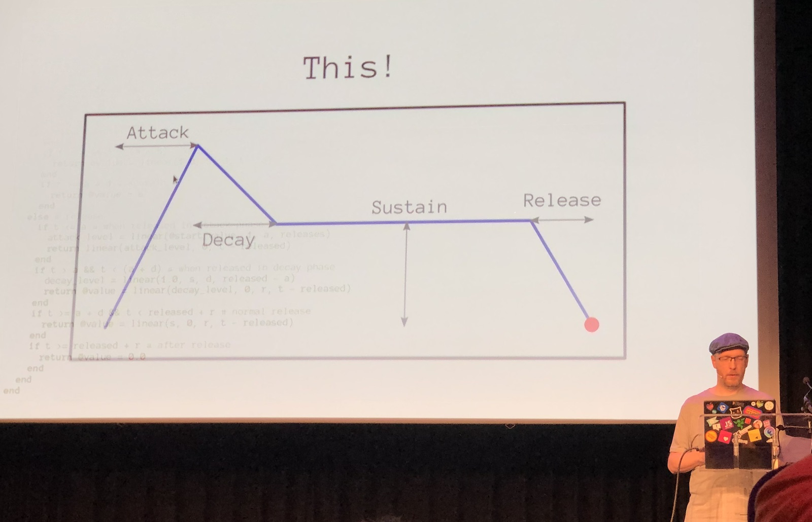
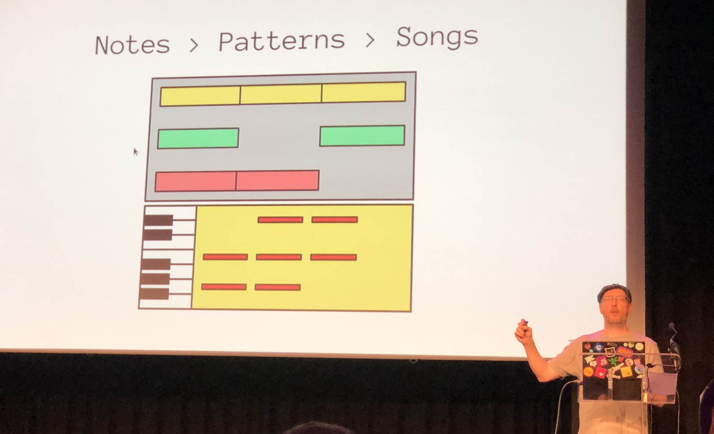
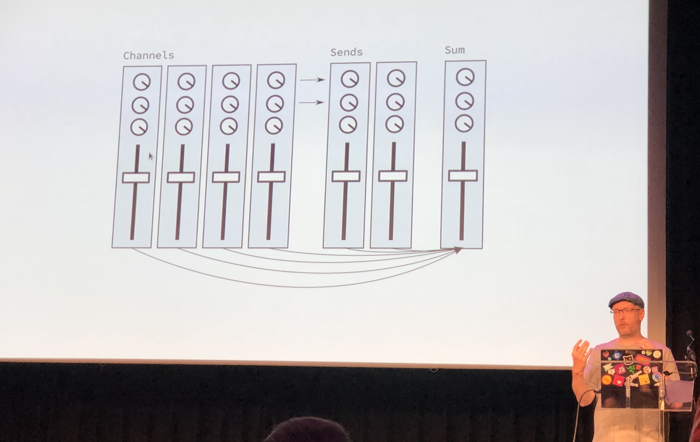

[👈 Back to all talks 👈](../README.md)

---

# The musical Ruby

## Jan Krutisch [@halfbyte](https://twitter.com/halfbyte)

We’re going to look at some examples of creating music in Sonic Pi. It’s an easy way to do music, but we’re going to dig deeper. We want to use pure Ruby and SoX for sound playback.

We can start by creating a simple square wave. We can then convert it into format that our sound card can understand. But how does it actually work? We know that sound is movement of air molecules. They move because we have a speaker that changes electrical current into air movement.

But computers are digital, so we neet some kind of Digital to Analog converter that can drive the speaker. Digital data is discreet, but electrical current isn’t. For discreete data we have a sampling rate that needs to be at last twice as high as highest sound that we want to play. 

Now we can get back to creating our music synth in Ruby. With all the knowledge we can now understand a little bit better what happens there. (note: we’ll be talking about music in context of wester notation).

On keyboard we have octaves, which are notest that are double the frequency apart. The only well defined note is A (440 Hz). We tune all different notes according to this one. And it’s kind of weird and not really perfect.

We’ll now try to “sculpt” the square wave we have and turn it into something that sounds nicer. We can use a State Variable Filter for this. The best thing about those filters is that we can either code them or make them into electronics. With a low pass filter we can get rid of “harsh", part of sound.

Another block we need is envelope. It’s a way to describe how the sound changes with time. And we can control many different aspects with it. Volume, amplitude, filter frequency or pitch.

Before we connect all the pieces into a final sound, we take a break to talk about drums sounds. Each drum has it’s own characteristic, but we can mimick them with tools we already know.

We can now create a variety of different sounds. We have to turn them into music now. To do music we have to take learn about some music theory: measure and tempo. Once we have this figured out we can group notes into patterns, which can be then arranged into songs.

Once we have our song we can proceed to mixing, which will add more depth to it. We have channels, which are usually our instruments, which we can mix together. We can apply additional processes to our channels to make them easier to mix. We have equalizers that allow us to avoid overlapping frequencies fro multiple channels. Then, we’ve got  whats called an “Insert FX”. Those are pretty much any effects we want to apply to our channel, and also a chorus.

Once we apply this to out song, we can have something that finally sounds like an actual song.

