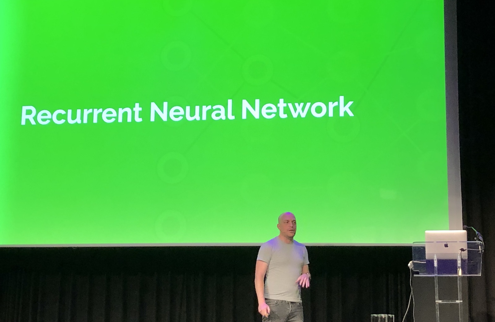
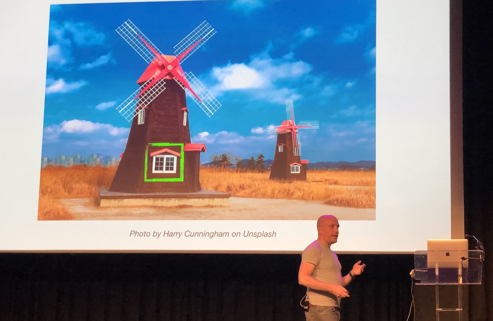
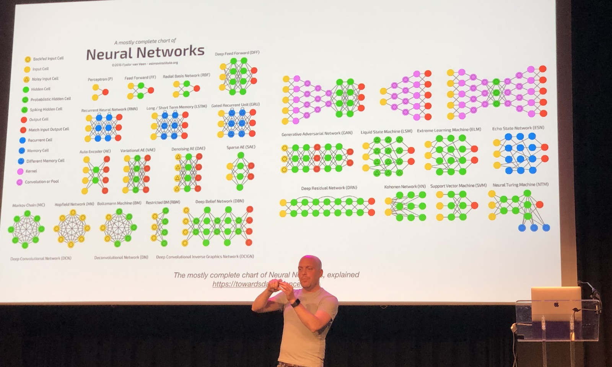
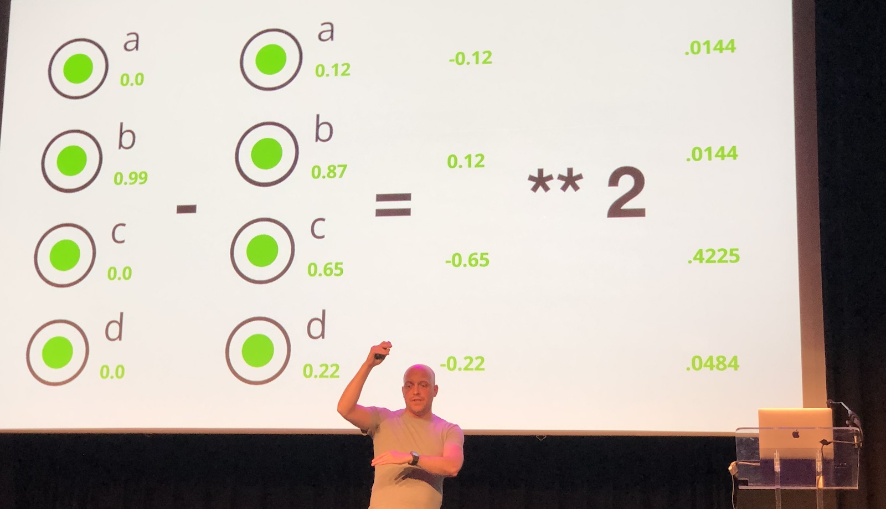
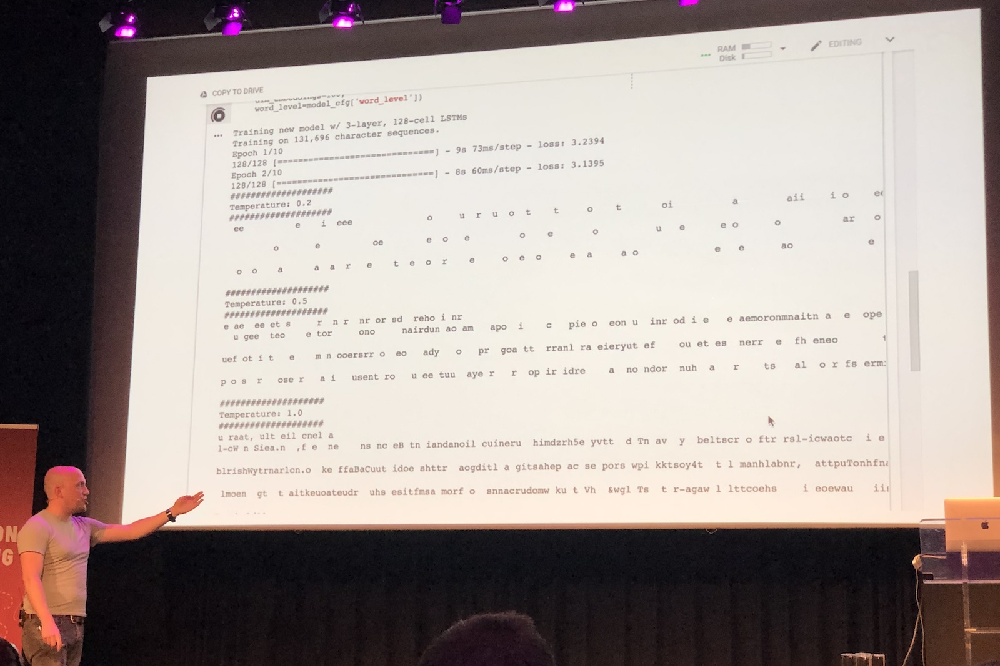
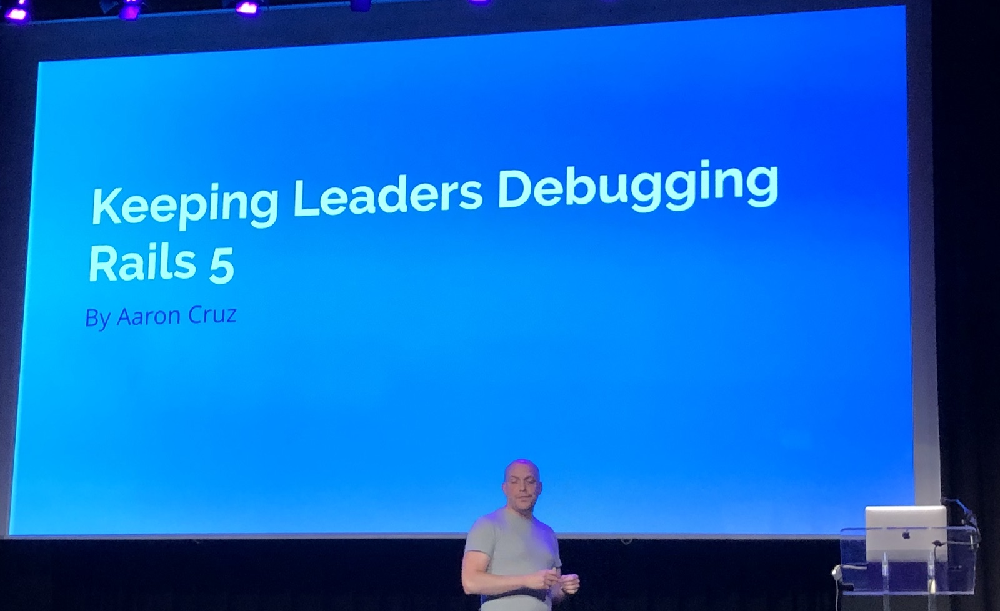

[👈 Back to all talks 👈](../README.md)

---

# Steal this talk

## Aaron Cruz [@mraaroncruz](https://twitter.com/mraaroncruz)

Conferences may be a great way to meet fellow nerds interested in same technology. That’s how you can get into great communities. At some point you may decide to start giving talks yourself, you can start small, with local user groups, and scale up to big, international conferences. But at some point you may meet a dead end, and get stuck in your journey of being a speaker. What if you run out of ideas?

Then you can create a neural network to do this for you. And we could use a Recurrent Neural Network to do this. Let’s first consider how could we make a program that recognises objects. It looks at some characteristic features of an object and with some confidence make a guess. But we can’t categorise all of things in the World that way.

We can try to go a level higher and have more specialized programs that can communicate. We can classify parts of objects and build on top of that. But it’s also not really efficient.

That’s where neural networks come in handy. We reduce resolution of our imega, get rid of colors and feed it into our network. I has multiple inputs and layers that do some calculations. In the end we get a confidence score.

In order to make the network learn we can use Back Propagation. The way it works is once we correctly recognise an object we can strenghten the connections that suggested the right choice. We can also weaken connections in case of an error.

But we may need a different kind of network to generate sentences than the one used to calssify images. Convolutional Neural Networks are the ones great for images recognition. In case of text generation it’s better to use Recurrent Neural Network. The biggest advantage is that it’s able to remember the context and history of what has happened before.

In order to train such network we can give it a bunch of text similar to what we want to generate. In order to improve network performance we need to reduce Loss Value. We calculate errors of generated data and calculate how much different from “right” answer it was. And we try to minimize it with each training session.

With each training session our network first learns about letters, words and sentences, and finally starts to get better and better. After training was done we were able to ask our network to generate a talk for us. That was the result:

But why shuld we give a talk ourselves. There is a tool that takes a sample of our voice and uses it for sythesysis. This way we don’t have to do anything. We have a neural network generating our talks and a synthesiser talking for us.