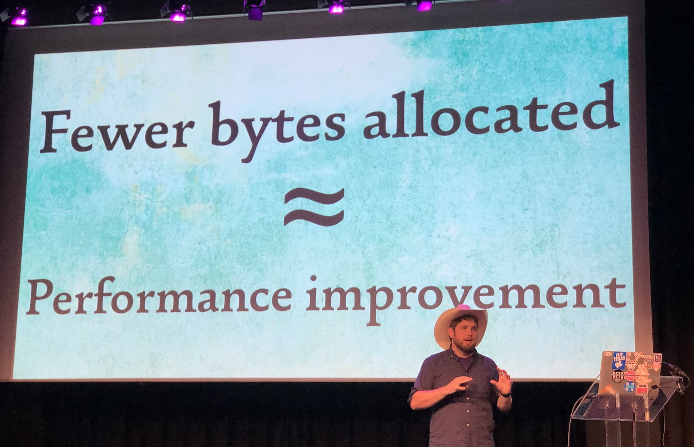
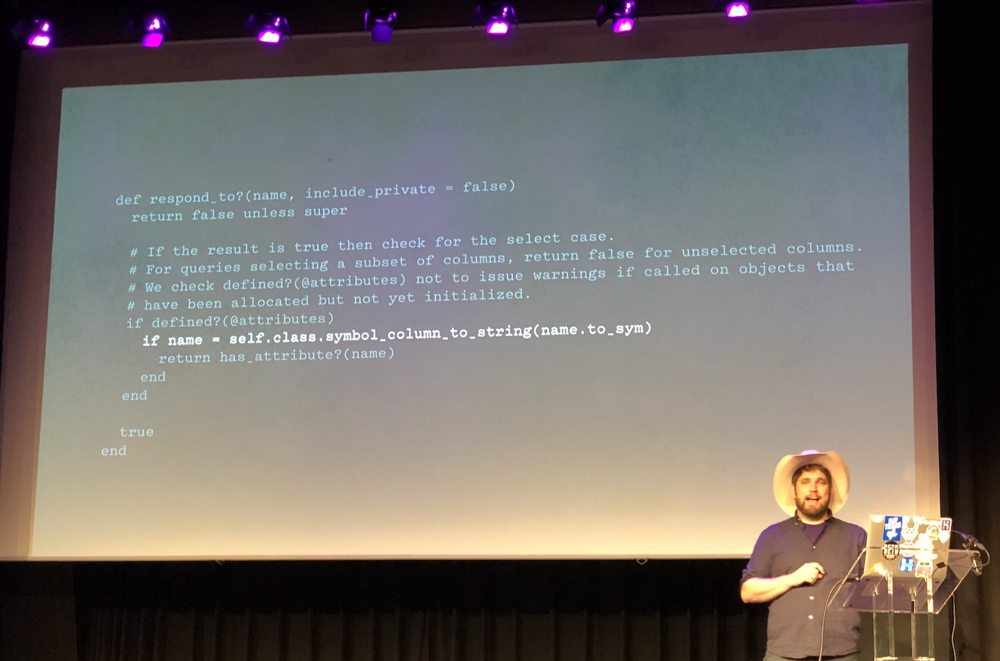
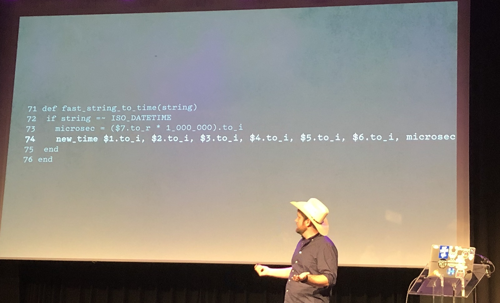
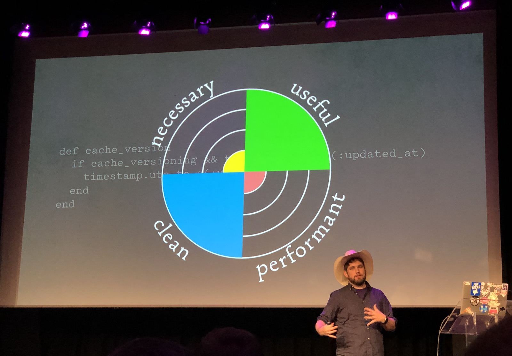

[👈 Back to all talks 👈](../README.md)

---

# The Life-Changing Magic of Tidying Active Record Allocations

## Richard Schneeman [@schneems](https://twitter.com/schneems)

We’ll mostly talk about performance here. Let’s approach it with Marie Kondo method. In order to put objects into “a pile” we will use memory profiler and derailed benchmark.

We know that memory allocation is expensive. We can often use comparison instead of allocation and have a quick performance boost. On avarage there is a linear relation between speed gain and memory allocation reduction. In terms of performance, bytes allocated im more important metric than allocated objects.

Let’s begin by installing `memory_profiler` and `derailed_benchmarks` gems. We begin by running `memory_profiler` and looking through it’s output. It shows us where most of memory allocations come from. One of the AR methods that seems to be a memory heavy is actually `has_attribbute?` which allocates a string to compare it with existing database columns.

We know that this method is clean, but is it really necesary? What if we take this allocation out of this method? It would of course break all existing application. But we can try to do the required comparison without having to allocate a string. And this reduced memory allocation by 1% for the whole request.

But the problem with benchmarks is that they can often introduce some errors. We need to check if it’s statistically significant change. We can use T-test for this. As it turns out this one patch was significant. It was only x1.01 speedup, but still...

Let’s now try another method of cleaning our code. We now look at time value of our code. There is another method that converts string to a time, called `fast_string_to_time`. We can do some microoptimizations there and get some performace improvement.

But we’re not sure how this method is usually used. We can add a debugger there and look at usage. As it turns out some databases won’t return timestamps as time, but rather as a string. AR uses the previous method to do the casting. Even though this approach is clean we can replace it with something faster (sacrifising cleanliness). We can achieve 5% reduction of memory allocation gain this way. But this conversion is quite CPU intensive, which gives us x1.12 performance boost.

With a few small improvements like this we got close to 25% speed improvement. We can take these techniques and apply them to our own code.