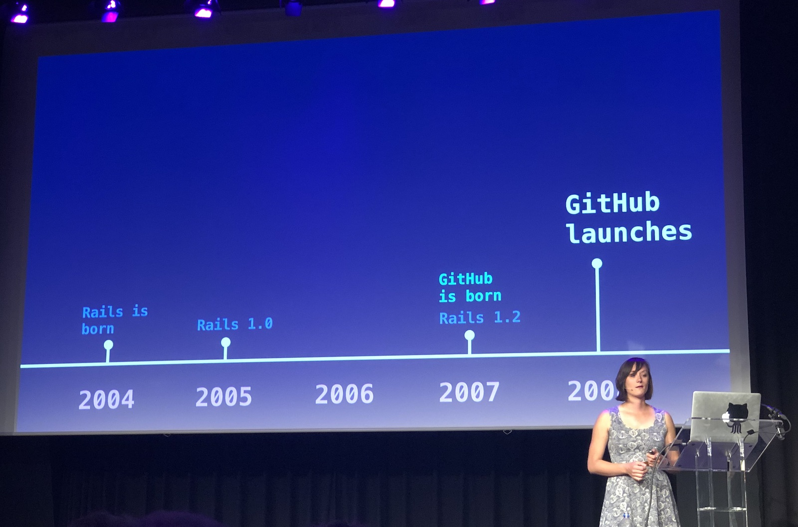
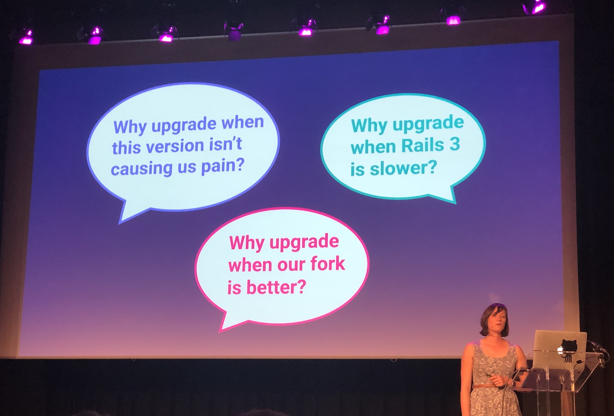
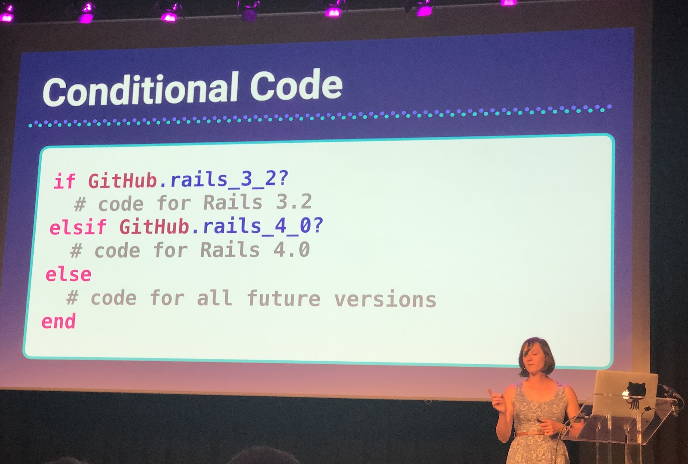
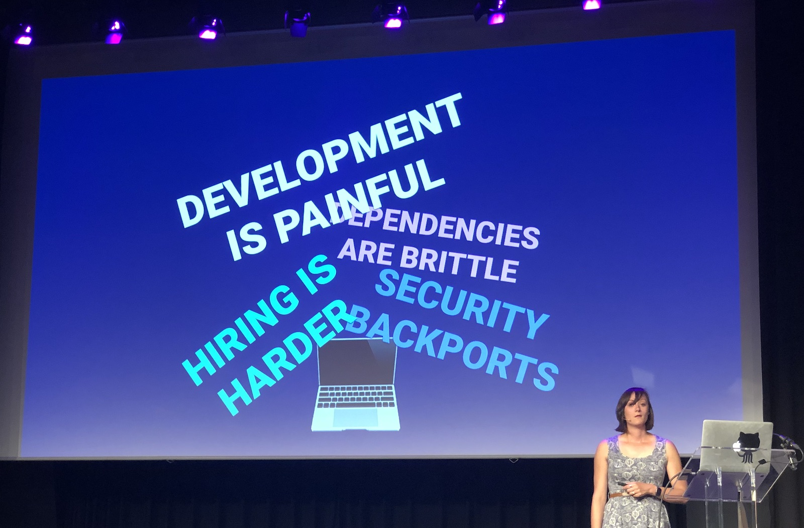
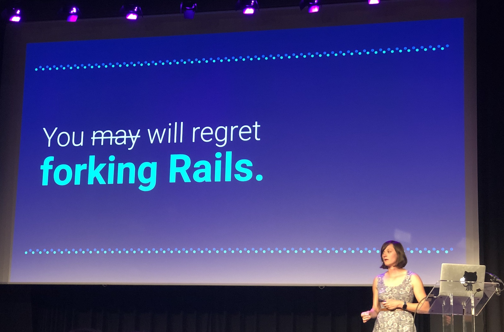

[👈 Back to all talks 👈](../README.md)

---

# Closing keynote: The Past, Present, and Future of Rails at GitHub

## Eileen M. Uchitelle [@eileencodes](https://twitter.com/eileencodes)

This presentation started as a story of upgrading Rails, but in the meantime diverged into something more. We’ll take a look at why and how is Rails used at Github. This is a story of costs of not upgrading, piling technical debt and having to maintain own form of a framework.

Rails has been popular since the very beginning. It’s been extracted from basecamp, not built for the purpose of doing a new application. That’s what DHH believes made it better.

Github launched on Rails 1.2 and quickly became closely working with Rails. Some time in 2009 Github forked Rails 2.3 and have been working on their fork since. And this fork had a lot of new features and fixes just for Github. This made the two versions incompatible.

Then, when Rails 3.0 was released there was a slow process of trying to upgrade it at Github as well. After 2 years all upgrade works has been stalled. There were many doubts and people weren’t sure about need to upgrade.

There were many problems. Security backborts were a real pain, there was problem with hiring people, because nobody wanted to work on an old fork. It was getting more and more painful to maintain this. By the time Github upgraded to custom fork of 3.0, Rails 4.0 has already been out. By the time Github decided to start upgrade to 4.0, version 5 was already out. 

In order to make upgrades faster, there were tries of dual booting github code. It was converted so it supported two different rails versions via an environment variable. There were many helper methods that had branches depending on Rails version.

It made upgrades easier and by 2019 Github caught up with Rails and got rid of custom fork. It’s now running 5.2 master.

It was the first time in 10 years that Github actually used upstream Rails. Upgrading is expensive and time consuming, but in the long run it may be cheaper to upgrade that not upgrading. Not upgrading gives you more and more work overtime. You’re responsible for patching security vulnerabilities yourself. You can’t easily find new people for your team.

If you’re stuck with older version you should try to approach it with a plan. Build a team that will work on the process, have a plan for it. If you’re upgraded, never ignore deprecation warnings, and always have a plan for the future to avoid building technical debt.

You may thinks it’s not worth the hassle, but you will at some point regret forking Rails. You will fall behind with security upgrades and will fall into complex dependency problems and unsupported gems.

Once you upgrade you’ll have access to many new great features. New, better APIs, more security features, better performance, and new libraries. On top of that you get an opportunity to contribute to upstream - you can't do this while working with old version.

