1. Madison White: Super-powering your editor with Sorbet Typer

   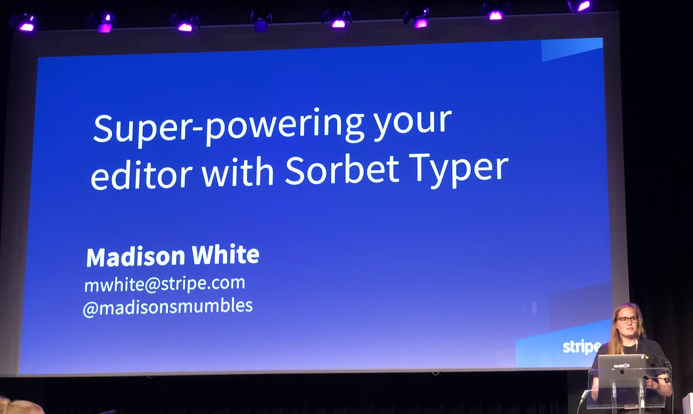

   Sorbet has been created by Stripe. It’s super fast and powerful, compatible with Ruby in 100%. You don’t need to add types everywhere, just where you need it. It’s just been open sourcet, but has been used in Stripe for quite some time.

   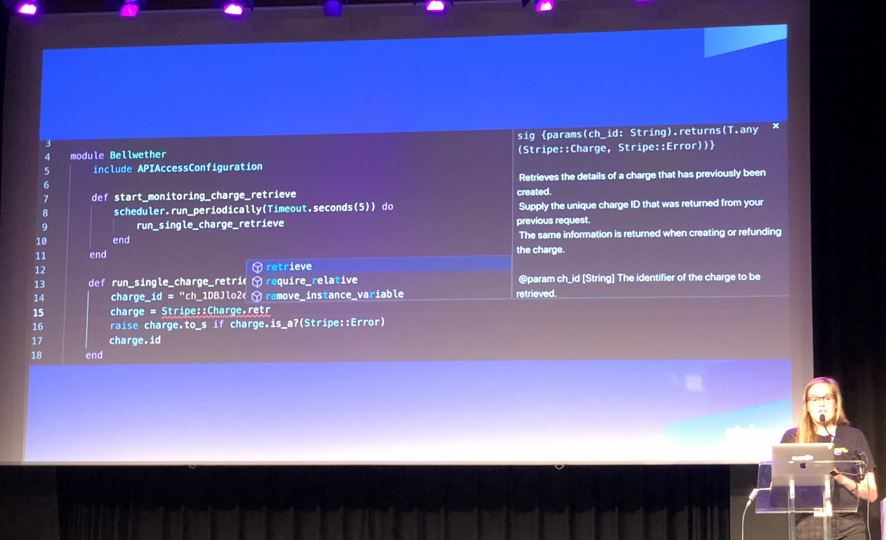

   “Old way” of working with Sorbet was to write code, and then run sorbet and see all the possible errors. To make it easier there is an extension for VS Code that runs sorbet while you write your code. It not only helps with types, but also shows a preview of method documentation.

   The integration is sadly not open source yet, but sorbet already is.

2. Julik Tarkhanov: NoSuchBucket: Tests, sleeps and eventual consistency

   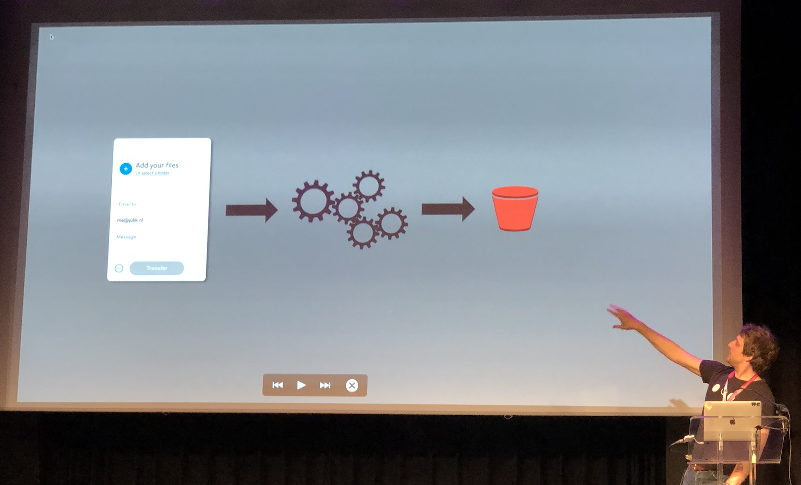

   We have an application that puts some data into Amazon buckets. We have some tests that were getting close to becomming integration tests, because it was touching many different modules. At some point the test suite stopped passing.A few tries of fixing it were unsuccessful. We don’t want to stub out our test yet. Let’s  see what happens if we create Amazon buckets really fast. Out of 100 calls we got a few failures. As it turns out Amazon can sometimes have a light delay. It seemed like the only way was to add a delay to all tests, but it was not feasible.

   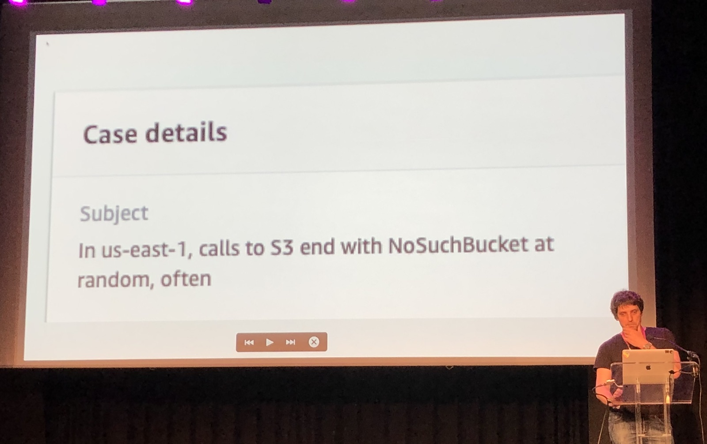

   Amazon was not really helpful, becaus it’s an expected behavior for them. It turns out that this problem occures in different projects as well.

3. Miriam Tocino: Zerus & Ona: Adventures in the Binary World

   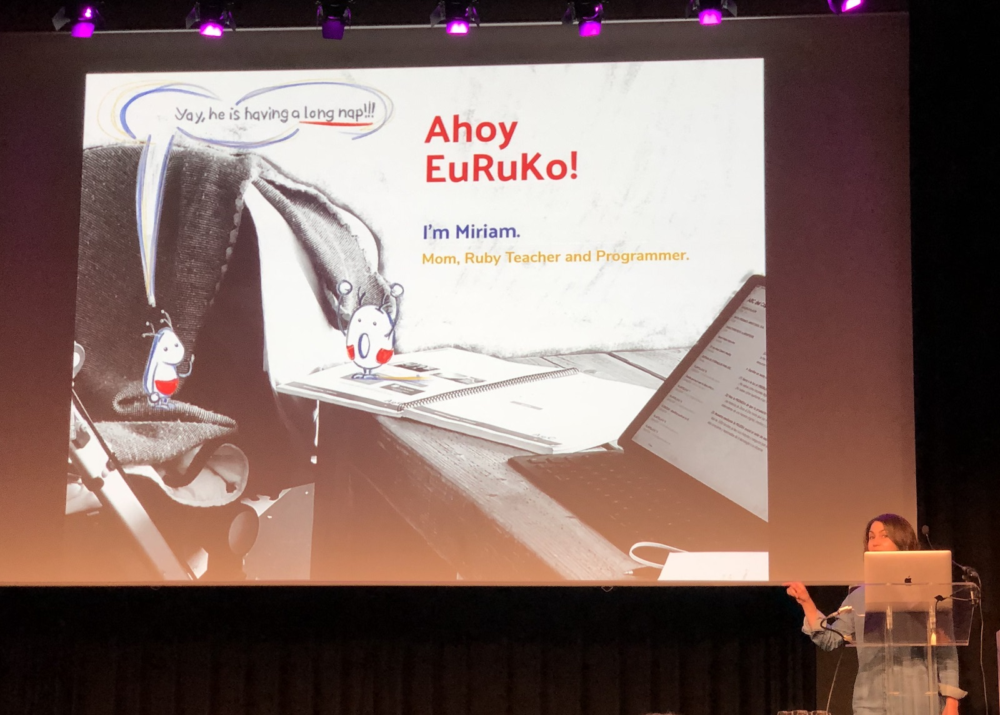

   Mom, Ruby Teacher and Programmer. Teaching binary through a kids stories. We don’t have to be raising programmers, but just giving kids an understanding about the surrounding world. They will have tools available for the future. We need new and original ways of introducint computer technology to kids, because technology is everywhere in our life.

   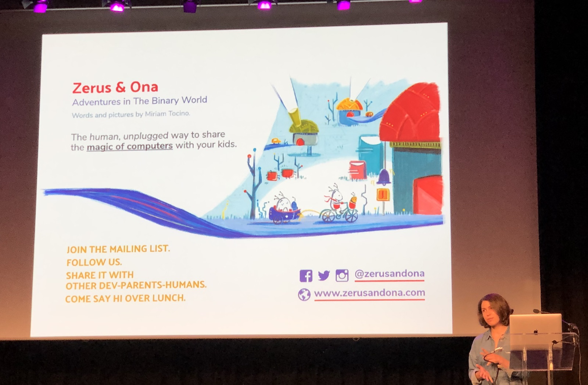

   There are a few books available that we can use to teach kids the world of computer science.

4. Benjamin Vetter: search_flip: full-featured, fun and easy to use Elasticsearch ruby cient with a chainable DSL

   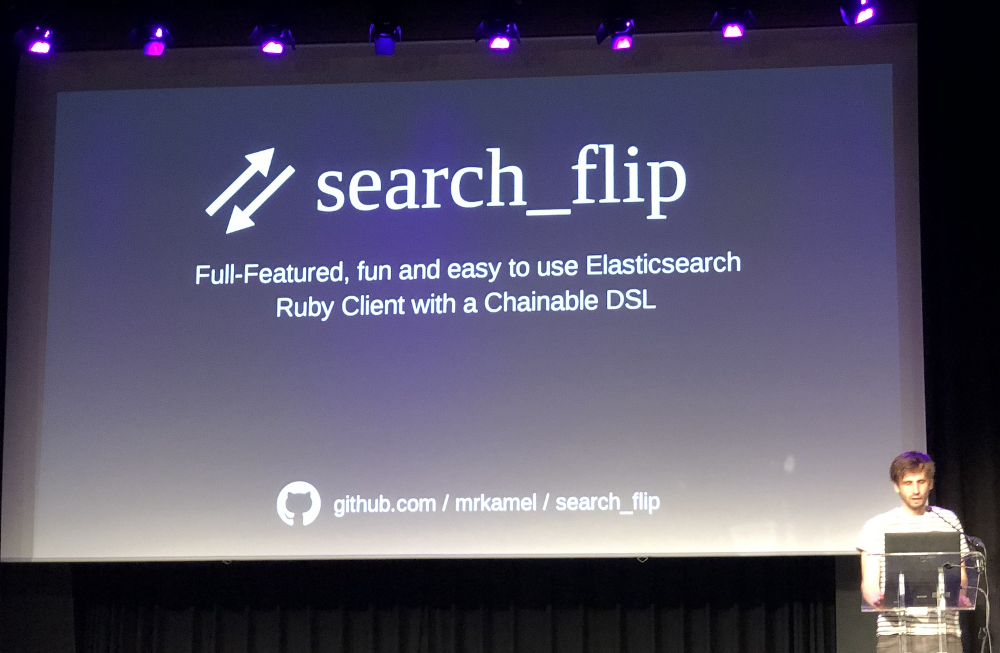

   `search_flip` is a full featured elasticsearch client for Ruby. Why do we need another client for this? There are already some clients out there. Let’s compare how we could execute a simple query using different clients.

   In elasticsearch-ruby we have to write raw elastic queries, which is quite bulky and error prone. Than there is searchkick, where most of query is changed into ruby hash that is passed to search emthod. But it doesn’t feel like activerecord does.

   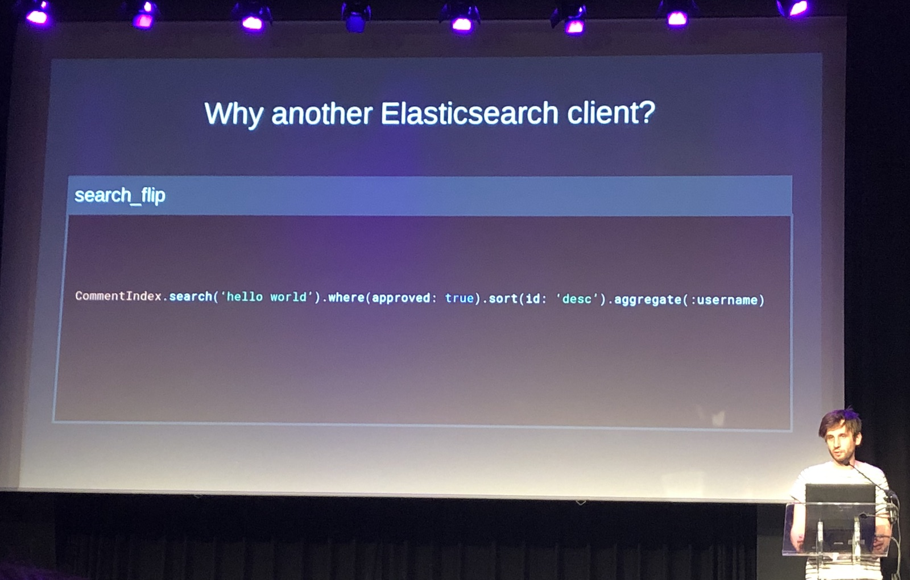

   That was aim of search_flip. To have a client that feel like activerecord. And you can try this gem for yourself

5. Norma Miller: A “Splash” Course on Live Captioning

   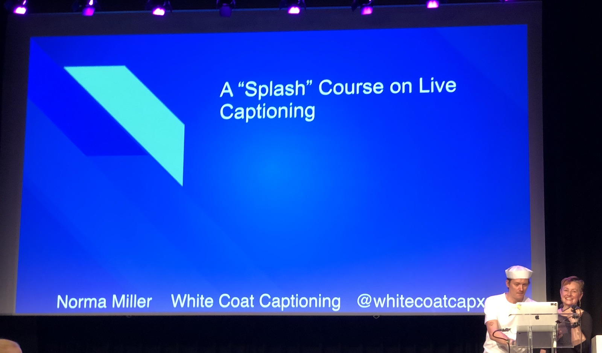

   White Coat Captioning is a company that does live cationing for a huge number of tech conferences. Some time ago people (for example incourd) were doing steno notes and had to rewrite them into “readable” form later on.

   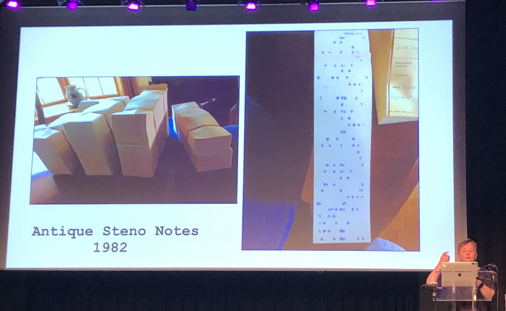

   But then steno keyboards became a thing and it’s now possible to write text really fast using it. During yesterday talk there was 99.94% accuracy with captioning.

   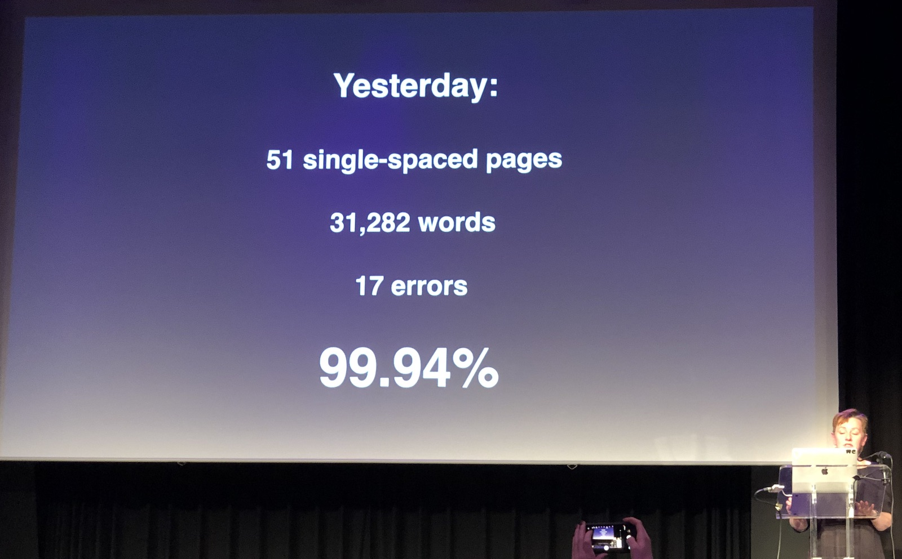

   That’s what you can achievie when you specialize in captioning tech conferences. To help captioners always provide slides ahead of time and talk slower - there is a limit to how fast one can write, even when using steno keyboards.